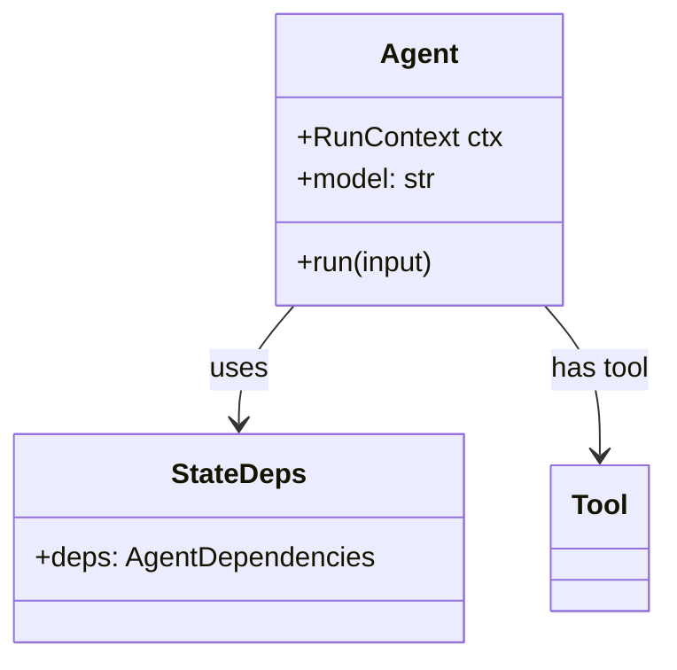
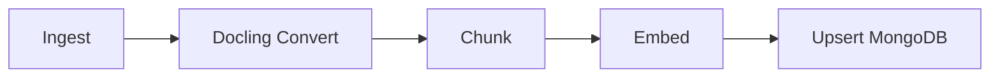

# Task: Generate Hierarchical AGENTS.md for Agentic Developers

## Objective

Produce a **hierarchical AGENTS.md system** that helps AI coding agents understand and navigate the codebase efficiently. Documentation is **derived from code**—never invented. Every module or submodule gets structured guidance plus Mermaid diagrams.

---

## Core Principles

1. **Code is the source of truth** — Read actual classes, functions, and imports. Do not document what you assume; document what exists.
2. **Mermaid diagrams are mandatory** — Every module/submodule AGENTS.md must include diagrams for classes and processes.
3. **Root is lightweight** — Universal guidance only; link to sub-files. Sub-folders carry the detail.
4. **Nearest-wins hierarchy** — Agents read the closest AGENTS.md to the file being edited.
5. **JIT indexing** — Provide paths, globs, and commands; avoid pasting full content.
6. **Token efficiency** — Small, actionable guidance over long prose.

---

## Mermaid Diagram Requirements

### Class Diagrams

Generate from **actual code** (classes, interfaces, Pydantic models, etc.):



- **Source**: Inspect `class`, `BaseModel`, `TypedDict`, `Protocol` definitions.
- **Relationships**: `extends`, `implements`, `uses`, `has`.
- **Include**: Public attributes and key methods only.

### Process / Flow Diagrams

Generate from **actual flows** (ingestion, search, API handshake):



- **Source**: Trace function calls, pipeline stages, async sequences.
- **Shapes**: `flowchart` for processes, `sequenceDiagram` for request/response flows.
- **Avoid**: Generic flows; prefer flows that match real code paths.

### Diagram Maintenance

- When adding or updating an AGENTS.md, **regenerate diagrams** from current code.
- Place diagrams in a `## Architecture` or `## Diagrams` section.
- Keep diagrams focused: one for structure, one for key processes.

---

## Process

### Phase 1: Repository Analysis (Code as Source)

Analyze the codebase by **reading code**, not guessing:

1. **Repository type** — Monorepo, multi-package, or single project.
2. **Tech stack** — From `pyproject.toml`, `package.json`, imports.
3. **Major directories** — Apps, services, packages, workers.
4. **Classes and models** — Actual `class`/`BaseModel` definitions for diagrams.
5. **Process flows** — Main pipelines (ingestion, search, API).
6. **Build & test** — From `pyproject.toml`, `package.json`, scripts.
7. **Patterns** — From real file structure and naming.

Output a **structured map** before generating any AGENTS.md.

---

### Phase 2: Generate Root AGENTS.md

Lightweight root (~100–200 lines). Required sections:

| Section | Content |
|--------|---------|
| **Project Snapshot** | Repo type, tech stack, note on sub-AGENTS.md |
| **Root Commands** | Install, build, typecheck, test (copy-paste ready) |
| **Universal Conventions** | Style, commits, branches, PR rules |
| **Security & Secrets** | No tokens in code, `.env` usage |
| **JIT Index** | Directory map with links to sub-AGENTS.md |
| **Definition of Done** | Pre-PR checklist |

Root AGENTS.md may omit Mermaid diagrams; keep it high-level.

---

### Phase 3: Generate Sub-Folder AGENTS.md

For each major package/directory, create a **detailed** AGENTS.md.

#### Required Sections

**1. Package Identity** (2–3 lines)
- Purpose (from code and README)
- Primary tech/framework

**2. Architecture (Diagrams)** — mandatory

- **Class diagram** — From actual classes/models in this package.
- **Process diagram** — Main flow(s) this package implements.

```markdown
## Architecture

### Class Overview

```mermaid
classDiagram
    ... (derived from code)
```

### Process Flow

```mermaid
flowchart LR
    ... (derived from code)
```
```

**3. Setup & Run** (5–10 lines)
- Install, dev, build, test commands (from actual scripts)

**4. Patterns & Conventions** (10–20 lines)

- File organization (from real structure)
- Naming (from real files)
- Examples with **real paths**:
  - ✅ DO: `src/components/Button.tsx`
  - ❌ DON'T: `src/legacy/OldButton.tsx`

**5. Touch Points / Key Files** (5–10 lines)
- Auth, API client, types, config — from actual imports and usage

**6. JIT Index Hints** (5–10 lines)
- ripgrep, find, glob commands that work on this repo

**7. Common Gotchas** (3–5 lines)
- From real issues (e.g., async/await, env vars, index setup)

**8. Pre-PR Checks** (2–3 lines)
- Single copy-paste command

---

### Phase 4: Special Considerations

If the repo has these, add structured sections:

| Area | What to document |
|------|------------------|
| **Design System / UI** | Paths, tokens, example components |
| **Database / Data** | Schema location, migrations, connection pattern |
| **API / Backend** | Route layout, auth, validation, error handling |
| **Testing** | Test layout, mocks, coverage commands |

Again, derive from code—paths, classes, and flows.

---

## Output Format

1. **Analysis Summary** — Store under `docs/AGENTS_analysis_summary.md`
2. **Root AGENTS.md** — Ready to use
3. **Sub-folder AGENTS.md** — One per major package

For each file, output:

```
---
File: `AGENTS.md` (root)
---
[content]

---
File: `src/ingestion/AGENTS.md`
---
[content including Mermaid diagrams]
```

---

## Quality Checks

Before generating or updating:

- [ ] All documented classes exist in code
- [ ] Mermaid diagrams reflect current structure and flows
- [ ] Root AGENTS.md is under 200 lines
- [ ] Root links to all sub-AGENTS.md files
- [ ] Every "✅ DO" has a real file path
- [ ] Every "❌ DON'T" references a real anti-pattern or legacy file
- [ ] Commands are copy-paste ready
- [ ] Diagrams are derived from code, not invented
