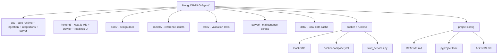
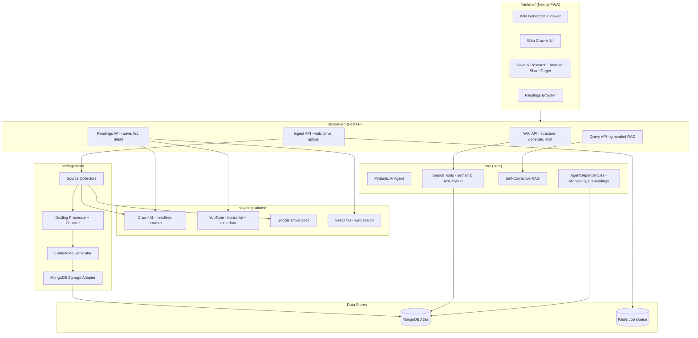

# MongoDB RAG Agent - AGENTS.md

## Agent Behavioral Protocols

### Thinking Process
1. Explore existing patterns in src/ before adding new ones.
2. Verify DRY: reuse providers, dependencies, and tool patterns.
3. Plan before execution when touching multiple files.
4. Drift check: if docs conflict with code, follow code and flag the mismatch.

### Safety Constraints
- Never run destructive commands without explicit confirmation:
  - rm -rf, docker system prune -a, database drops.
- Do not attempt to create Atlas Vector/Search indexes programmatically.
- No blind retries; inspect logs and adjust strategy.
- Treat environments separately (local Docker vs Atlas).
- Never log or commit secrets (.env contents).

### Development Workflow
- Use feature branches for new work; avoid committing directly to main.
- Open a PR for any new feature or multi-file change.

## Token Economy & Output
- Keep responses concise; reference file paths instead of dumping full files.
- Prefer small, targeted edits; avoid reformatting.
- Surface only the minimum code or config necessary to resolve tasks.

## Universal Tech Stack

### Repository Type
- Single-repo application (MongoDB RAG agent + ingestion + CLI).

### Languages & Frameworks
- Python 3.10+
- Pydantic 2.x, Pydantic AI 0.1.x
- PyMongo 4.10+ (async client), OpenAI SDK
- Docling 2.14+, Transformers
- Rich 13.9+ for CLI

### Core Commands

# Setup
- uv venv
- uv sync

# Validate config
- uv run python -m src.test_config

# Ingest documents
- uv run python -m src.ingestion.ingest -d ./documents

# Run CLI
- uv run python -m src.cli

# Docker (self-hosted)
- docker-compose up -d
- docker-compose logs -f rag-agent
- python start_services.py

## Docker Configuration
- Use host ports in the 7000–7500 range to avoid conflicts with other infrastructure.
- Current defaults:
   - MongoDB: 7017 -> container 27017
   - Mongot (Atlas Search): 7027 -> container 27027
   - SearXNG: 7080 -> container 8080
- Prefer `.env` with `env_file` in compose to reduce inline environment noise.

# Lint / Format
- uv run ruff check .
- uv run black .

## Architecture Overview

### Component Organization
- src/: core agent runtime, tools, providers, CLI.
- src/ingestion/: Docling conversion, chunking, embeddings, ingestion pipeline.
- src/integrations/: external service integrations (Crawl4AI, Google Drive/Docs).
- src/logging_config.py: shared console logging configuration.
- documents/: sample and user-provided documents.
- examples/: reference-only patterns (do not modify).
- sample/: validation and example scripts by domain.
- tests/: pytest-style validation tests.

### Data Flow
1. Ingestion converts documents → DoclingChunks (structure-aware, inherits Source, includes MetadataPassport and frontmatter) with embeddings.
2. Chunks + documents stored in MongoDB (two-collection pattern).
3. Deduplication is handled via upsert on content_hash (hash of chunk body); minor changes to chunk text will create new entries, but this ensures no exact duplicates. Optionally, deduplication can be keyed on source identity (e.g., URL) if required.
4. Agent queries MongoDB via semantic, text, and hybrid search.

### Service Composition Pattern
- Not used; prefer small, focused classes and async functions.

### Docker Compose & Port Mapping

- **MongoDB**: Host port 7017 → container 27017
- **Mongot (Atlas Search)**: Host port 7027 → container 27027
- **SearXNG**: Host port 7080 → container 8080

These ports are set in `docker-compose.yml` and must match `.env` and app settings. See `docs/design_patterns.md` for details and best practices.

- All sensitive values and connection strings are set in `.env` and referenced in compose files using `${VAR}` syntax.
- Avoid mapping multiple services to the same host port.
- If you change a port, update all references in `.env`, compose, and settings.

See also: [docs/design_patterns.md](docs/design_patterns.md)

---

## Repository Map (Top Level)

## Full System Architecture

## File Organization & Root Directory Standards

Do not create new root-level files or directories beyond AGENTS.md. Use:
- .github/ for GitHub configs
- .claude/ for reference docs
- docs/ for documentation
- scripts/ for maintenance scripts (avoid modifying)
- sample/ for validation scripts
- tests/ for pytest-style checks
- temp/ for scratch (gitignored)

### DoclingChunks Model Refactor
When: chunking and storing document segments for RAG.
Pattern: Use `DoclingChunks` (renamed from `DocumentChunk`), which inherits from `Source` and includes the full `MetadataPassport` and frontmatter. See `src/ingestion/docling/chunker.py` for implementation.
Anti-pattern: Using ad-hoc chunk models or omitting metadata/frontmatter.

### Intelligent Chunking Sample
When: chunking large documents with structure-aware subsetting.
Pattern: See `sample/docling/chunk_pydantic_sample.py` for an example that subsets markdown by headings before chunking into `DoclingChunks`.
Anti-pattern: Blindly chunking large documents without subsetting or structure awareness.

### Dependencies Initialization
When: MongoDB or embedding client access.
Example: src/dependencies.py
Anti-pattern: creating ad-hoc clients per call without cleanup (reuse `AgentDependencies` via `StateDeps`).

### Search Pipelines with Lookup
When: returning search results.
Example: src/tools.py
Anti-pattern: missing $lookup for document metadata.

### Docling Hybrid Chunking
When: chunking multi-format documents.
Example: src/ingestion/chunker.py
Anti-pattern: passing raw markdown string to HierarchicalChunker.

### External Ingestion Sources
When: pulling content from Crawl4AI or Google Drive/Docs.
Example: src/ingestion/ingest.py and src/ingestion/google_drive.py
Anti-pattern: bypassing metadata extraction or skipping Docling conversion for file formats.

### Integration Exports (Frontmatter)
When: exporting markdown from integrations (Crawl4AI, Google Drive).
Example: src/integrations/models.py
Anti-pattern: returning raw markdown without `SourceFrontmatter`.

### Logging Configuration
When: initializing CLI or batch scripts.
Example: src/logging_config.py
Anti-pattern: per-module logging.basicConfig calls with inconsistent formats.

## JIT Index (Component Map)

### Stack-Level Documentation
- src/AGENTS.md - core runtime, tools, CLI patterns
- src/ingestion/AGENTS.md - ingestion and chunking pipeline
- src/server/AGENTS.md - FastAPI server, API routes, services
- frontend/AGENTS.md - Next.js PWA, pages, components

### Module-Level Documentation
- src/integrations/AGENTS.md - all external service adapters
- src/integrations/crawl4ai/AGENTS.md - headless browser crawling
- src/integrations/youtube/AGENTS.md - YouTube transcript + metadata
- src/integrations/google_drive/AGENTS.md - Google Drive/Docs export
- src/retrieval/AGENTS.md - embeddings, vector store, formatting
- src/query/AGENTS.md - grounded query with citation verification
- src/observability/AGENTS.md - PII redaction, tracing
- src/mdrag_logging/AGENTS.md - async logging, decorators
- src/server/api/wiki/AGENTS.md - wiki generation endpoints
- src/server/api/readings/AGENTS.md - save-and-research endpoints

### Component-Level Documentation
- server/maintenance/AGENTS.md - index initialization
- sample/AGENTS.md - validation and reference scripts

### YouTube and Readings Patterns
When: saving URLs (web pages, YouTube videos, tweets).
Pattern: `ReadingsService.save_reading()` detects URL type via `is_youtube_url()` and routes to the correct extractor. YouTube uses `YouTubeExtractor` for transcript + metadata; web uses Crawl4AI with httpx fallback.
Anti-pattern: Hardcoding URL handling without media-type detection.

### Wiki Generation from Ingested Data
When: generating knowledge wikis from MongoDB documents.
Pattern: `WikiService.generate_structure()` discovers documents, uses LLM to organize into sections/pages. Content is generated on-demand via streaming.
Anti-pattern: Pre-generating all page content upfront (slow, wastes tokens).

## Search Hints

# Find hybrid search
- /bin/grep -R "def hybrid_search" -n src

# Find ingestion workflow
- /bin/grep -R "class IngestionWorkflow" -n src/ingestion

# Find Crawl4AI integration
- /bin/grep -R "class Crawl4AIClient" -n src

# Find Google Drive integration
- /bin/grep -R "class GoogleDriveClient" -n src

# Find YouTube extraction
- /bin/grep -R "class YouTubeExtractor" -n src

# Find Readings save pipeline
- /bin/grep -R "class ReadingsService" -n src

# Find Wiki generation
- /bin/grep -R "class WikiService" -n src

# Find dependencies
- /bin/grep -R "class AgentDependencies" -n src

## Error Handling Protocol

1. MongoDB connection failures:
   - Verify MONGODB_URI, then ping in AgentDependencies.
2. Missing index errors (code 291):
   - Create vector/search indexes in Atlas UI.
3. Embedding failures:
   - Check EMBEDDING_API_KEY and EMBEDDING_MODEL.
4. Docling conversion errors:
   - Log and continue; do not crash ingestion.
5. Google Drive access errors:
   - Verify GOOGLE_SERVICE_ACCOUNT_FILE and optional impersonation subject.
6. Deduplication:
   - Upsert on content_hash prevents exact duplicate chunks. For source-level deduplication, consider using a source-identity key (e.g., URL).

## Agent Gotchas

1. Hybrid search uses manual RRF in src/tools.py (not $rankFusion).
2. Embeddings must be stored as Python lists, not strings.
3. HierarchicalChunker needs DoclingDocument; fallback chunking is last resort.
4. Examples folder is reference-only and should not be modified.
5. Ingestion is non-destructive by default; use `--clean` to wipe collections.
6. Crawl4AI requires the crawl4ai package (and Playwright runtime when crawling).
7. YouTube transcript extraction is synchronous — always wrap in `asyncio.to_thread()`.
8. The frontend is a PWA; `manifest.json` must be served at `/manifest.json` for Android Share Target to work.
9. Wiki structure LLM calls can return invalid JSON — always have a `_fallback_structure()`.
10. `ReadingsService` stores full content in MongoDB but excludes it from API responses (`full_content` field popped before return).
11. Frontend API routes are proxies to the backend; keep them thin (fetch + forward).
