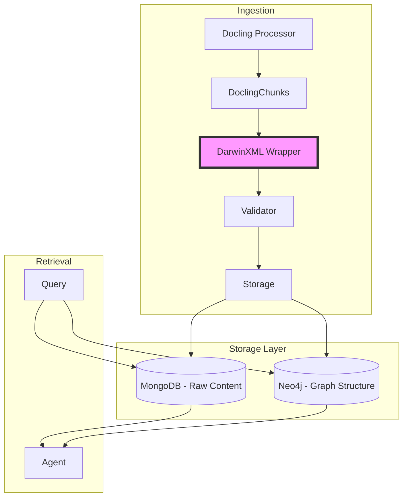
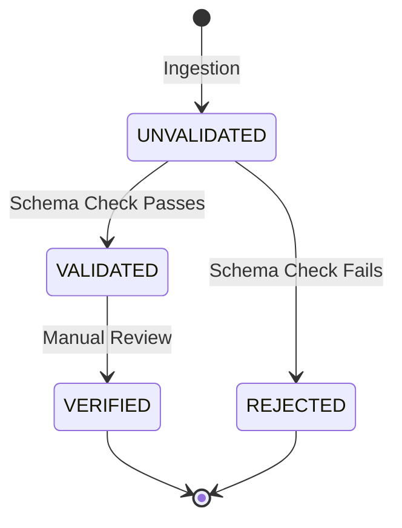

# DarwinXML: Semantic Document Wrapper for RAG Systems

## Overview

DarwinXML is a semantic wrapper system for Docling chunks that transforms raw document chunks into richly annotated, graph-ready data structures. It enables "Second Brain" architectures by adding hierarchical metadata, semantic tags, and relationship information that agents can use for intelligent retrieval.

## Why DarwinXML?

### The Problem with Traditional Vector Search

Traditional vector-based RAG systems treat documents as flat embeddings:
- **Lost Structure**: Document hierarchy (headings, sections) is flattened
- **No Context**: Relationships between chunks are implicit
- **Limited Metadata**: Only basic source/page information
- **Agent Friction**: Agents must reconstruct context from raw text

### The DarwinXML Solution

DarwinXML wraps each chunk with:
1. **Hierarchical Annotations**: Headings, sections, tables with parent-child relationships
2. **Semantic Attributes**: PARA categories, entity mentions, temporal references
3. **Graph Relationships**: Explicit edges for Neo4j integration
4. **Provenance Metadata**: Source lineage, validation status, tags

## Architecture



## Core Components

### 1. DarwinXML Models (`darwinxml_models.py`)

#### DarwinXMLDocument

The top-level container that wraps a Docling chunk:

```python
{
    "id": "uuid",
    "schema_version": "1.0",
    "document_title": "Sellaronda Trip Planning",
    "chunk_index": 0,
    "chunk_uuid": "chunk-uuid",
    "content": "# Budget\n- Accommodation: €500...",
    "annotations": [...],
    "provenance": {...}
}
```

#### DarwinAnnotation

Hierarchical structural elements:

```python
{
    "id": "ann-uuid",
    "type": "section",  # heading, paragraph, table, list, etc.
    "content": "Budget section content",
    "attributes": [
        {"type": "category", "name": "para_category", "value": "Project:Sellaronda"},
        {"type": "entity", "name": "named_entity", "value": "Italy"},
        {"type": "custom", "name": "is_table", "value": "false"}
    ],
    "relationships": [
        {"type": "parent", "source_id": "chunk-uuid", "target_id": "parent-chunk-uuid"}
    ]
}
```

#### ProvenanceMetadata

Tracks data lineage and quality:

```python
{
    "ingestion_timestamp": "2026-02-06T00:00:00",
    "source_url": "file:///documents/planning.md",
    "source_type": "upload",
    "validation_status": "validated",
    "content_hash": "sha256-hash",
    "tags": ["para:project", "chunker:hierarchical", "content:table"]
}
```

### 2. DarwinXML Wrapper (`darwinxml_wrapper.py`)

Converts DoclingChunks to DarwinXML format with automatic:
- **Annotation Extraction**: Infers content type from chunk structure
- **Attribute Tagging**: Detects PARA categories, entities, temporal markers
- **Relationship Building**: Constructs parent-child and sibling relationships
- **Batch Processing**: Handles multiple chunks with hierarchy preservation

```python
from mdrag.ingestion.docling.darwinxml_wrapper import DarwinXMLWrapper

wrapper = DarwinXMLWrapper(
    embedding_model="text-embedding-3-small",
    enable_entity_extraction=True,
    enable_category_tagging=True,
)

# Wrap single chunk
darwin_doc = wrapper.wrap_chunk(
    chunk=docling_chunk,
    document_id="doc_123",
    validation_status=ValidationStatus.UNVALIDATED,
    additional_tags=["project", "finance"],
)

# Wrap batch with relationships
darwin_docs = wrapper.wrap_chunks_batch(
    chunks=docling_chunks,
    document_id="doc_123",
)
```

### 3. Validator (`darwinxml_validator.py`)

Multi-level validation ensures data quality:

1. **Schema Validation**: Required fields, data types, schema version
2. **Content Validation**: Non-empty content, reasonable length
3. **Annotation Validation**: Valid IDs, parent references, content presence
4. **Provenance Validation**: Complete metadata, valid hashes
5. **Relationship Validation**: Valid references, no cycles

```python
from mdrag.ingestion.docling.darwinxml_validator import DarwinXMLValidator

validator = DarwinXMLValidator(
    strict_mode=False,  # Warnings don't fail validation
    require_annotations=True,
    require_provenance=True,
)

result = validator.validate(darwin_doc)

if result.is_valid:
    print("✓ Document valid")
else:
    for error in result.errors:
        print(f"✗ {error}")
```

### 4. Storage (`darwinxml_storage.py`)

Stores DarwinXML documents in MongoDB with:
- **Upsert by Content Hash**: Prevents duplicates
- **Searchable Fields**: Tags, attributes, validation status
- **Graph Triple Extraction**: For Neo4j integration
- **Semantic Queries**: By category, entity, status

```python
from mdrag.ingestion.docling.darwinxml_storage import DarwinXMLStorage

storage = DarwinXMLStorage(
    chunks_collection=db.chunks,
)

# Store document
doc_id = await storage.store_darwin_document(
    darwin_doc=darwin_doc,
    embedding=embedding_vector,
    upsert=True,
)

# Query by PARA category
results = await storage.query_by_category("para:project", limit=10)

# Query by entity mention
results = await storage.query_by_entity("Italy", limit=10)

# Extract graph triples for Neo4j
triples = await storage.get_graph_triples(darwin_doc)
```

## Integration with Ingestion Pipeline

### Enable DarwinXML

Run ingestion with DarwinXML enabled:

```bash
uv run python -m src.ingestion.ingest \
  -d ./documents \
  --enable-darwinxml \
  --darwinxml-validate \
  --max-tokens 512
```

### CLI Flags

- `--enable-darwinxml`: Enable DarwinXML semantic wrapper
- `--darwinxml-validate`: Validate documents (default: True)
- `--darwinxml-strict`: Strict mode - warnings become errors

### Configuration

Set in `IngestionConfig`:

```python
config = IngestionConfig(
    chunk_size=1000,
    max_tokens=512,
    enable_darwinxml=True,  # Enable wrapper
    darwinxml_validate=True,  # Validate docs
    darwinxml_strict=False,  # Allow warnings
)
```

## Semantic Features

### 1. PARA Category Tagging

Automatically detects PARA (Projects, Areas, Resources, Archives) markers:

```markdown
# Budget #p/Sellaronda
This is a project-related budget.

## Research #r/Italy
Reference material about Italy.
```

**Extracted Tags:**
- `para:project` (from `#p/Sellaronda`)
- `para:resource` (from `#r/Italy`)

**Attributes:**
- `{"type": "category", "name": "para_category", "value": "Project:Sellaronda"}`

### 2. Entity Extraction

Identifies proper nouns and entities:

```markdown
The Sellaronda route in the Dolomites is popular with cyclists.
We'll stay in Canazei and visit Corvara.
```

**Extracted Entities:**
- Sellaronda
- Dolomites
- Canazei
- Corvara

**Attributes:**
- `{"type": "entity", "name": "named_entity", "value": "Sellaronda", "confidence": 0.8}`

### 3. Temporal Markers

Detects date references:

```markdown
Departure: June 15, 2026
Return: June 22, 2026
We'll book accommodation next week.
```

**Extracted Markers:**
- `June 15, 2026`
- `June 22, 2026`
- `next week`

**Attributes:**
- `{"type": "temporal", "name": "temporal_reference", "value": "June 15, 2026"}`

### 4. Hierarchical Relationships

Preserves document structure:

```
Document: "Trip Planning"
  ├─ Chunk 0: "# Overview" (parent: None)
  ├─ Chunk 1: "## Budget" (parent: Chunk 0, sibling: previous)
  └─ Chunk 2: "### Accommodation" (parent: Chunk 1, sibling: previous)
```

**Relationships:**
- `{"type": "parent", "source_id": "chunk-1", "target_id": "chunk-0"}`
- `{"type": "sibling", "source_id": "chunk-1", "target_id": "chunk-0"}`

## Graph Integration (Neo4j)

### Extract Graph Triples

```python
triples = darwin_doc.extract_graph_triples()

# Example triples:
[
    {
        "subject": "Trip Planning",
        "predicate": "HAS_CHUNK",
        "object": "chunk-uuid-1",
        "properties": {"chunk_index": 0}
    },
    {
        "subject": "chunk-uuid-1",
        "predicate": "MENTIONS",
        "object": "Italy",
        "properties": {"confidence": 0.8}
    },
    {
        "subject": "chunk-uuid-1",
        "predicate": "HAS_TAG",
        "object": "tag:para:project",
        "properties": {}
    }
]
```

### Cypher Query Generation

```cypher
// Create chunk node
CREATE (c:Chunk {
    uuid: 'chunk-uuid-1',
    content: 'Budget section...',
    document_title: 'Trip Planning'
})

// Create entity nodes and relationships
CREATE (e:Entity {name: 'Italy'})
CREATE (c)-[:MENTIONS {confidence: 0.8}]->(e)

// Create tag relationships
CREATE (t:Tag {name: 'para:project'})
CREATE (c)-[:HAS_TAG]->(t)

// Create hierarchy
MATCH (parent:Chunk {uuid: 'parent-chunk-uuid'})
MATCH (child:Chunk {uuid: 'chunk-uuid-1'})
CREATE (child)-[:CHILD_OF]->(parent)
```

### Graph Queries for Agents

```cypher
// Find all chunks about Italy in project context
MATCH (c:Chunk)-[:MENTIONS]->(e:Entity {name: 'Italy'})
MATCH (c)-[:HAS_TAG]->(t:Tag {name: 'para:project'})
RETURN c.content

// Find document hierarchy
MATCH path = (leaf:Chunk)-[:CHILD_OF*]->(root:Chunk)
WHERE leaf.uuid = 'target-chunk'
RETURN path
```

## Agent Retrieval Strategies

### Semantic Tag Search

```python
# Find all project-related financial chunks
results = await storage.query_by_tags(
    tags=["para:project", "content:financial"],
    match_all=True,
    limit=20,
)
```

### Entity-Based Search

```python
# Find all chunks mentioning specific entities
results = await storage.query_by_entity("Sellaronda", limit=10)
```

### Hierarchical Context

```python
# Get chunk with parent context
chunk = await storage.get_darwin_document(chunk_uuid)
parent_chunks = await storage.get_parent_chunks(chunk_uuid)

# Reconstruct full section
full_context = "\n".join([p.content for p in parent_chunks] + [chunk.content])
```

## Validation Status Lifecycle



### Status Meanings

- **UNVALIDATED**: Newly ingested, no validation yet
- **VALIDATED**: Passes schema validation
- **VERIFIED**: Manually reviewed and approved
- **REJECTED**: Failed validation or rejected by user

### Update Status

```python
success = await storage.update_validation_status(
    chunk_uuid="chunk-uuid",
    new_status="verified",
)
```

## Success Criteria

✅ **Validation**: 100% of ingested chunks must pass schema validation

✅ **Hierarchy**: Every chunk retains parent information via DarwinXML attributes

✅ **Agent Speed**: Agents identify correct section using Neo4j/DarwinXML metadata in <500ms

✅ **Retrievability**: Semantic queries (by tag, entity, category) return relevant chunks

## Examples

### Run Demo Script

```bash
uv run python sample/darwinxml_demo.py
```

### Ingest with DarwinXML

```bash
# Basic ingestion with DarwinXML
uv run python -m src.ingestion.ingest \
  -d ./documents \
  --enable-darwinxml

# Strict validation mode
uv run python -m src.ingestion.ingest \
  -d ./documents \
  --enable-darwinxml \
  --darwinxml-strict

# Crawl + DarwinXML
uv run python -m src.ingestion.ingest \
  --enable-darwinxml \
  --crawl-url "https://example.com/docs"
```

## Best Practices

### 1. Use Hierarchical Chunking

DarwinXML works best with Docling's HierarchicalChunker:

```python
chunker_config = ChunkingConfig(max_tokens=512)
chunker = DoclingHierarchicalChunker(config=chunker_config)
chunks = await chunker.chunk_document(content, title, source, docling_doc=docling_doc)
```

### 2. Tag Consistently

Use consistent PARA tags in your documents:

```markdown
# Project: Sellaronda Trip #p/Sellaronda
## Budget #status/verified
## Research #r/DolomitesBiking
```

### 3. Validate Before Storage

Enable validation to catch issues early:

```python
config = IngestionConfig(
    enable_darwinxml=True,
    darwinxml_validate=True,  # Always validate
)
```

### 4. Query by Structure First

Use semantic tags to narrow search before vector search:

```python
# Fast: Filter by tags first
tagged_chunks = await storage.query_by_tags(["para:project"], limit=100)
# Then: Vector search within tagged chunks
results = vector_search(query, chunks=tagged_chunks)
```

### 5. Preserve Provenance

Store provenance metadata for audit trails:

```python
provenance = {
    "source_url": "https://original-source.com",
    "crawl_session_id": "session-123",
    "tags": ["verified", "finance"],
}
```

## Troubleshooting

### Validation Errors

```python
# Check validation results
result = validator.validate(darwin_doc)

if not result.is_valid:
    print("Errors:")
    for error in result.errors:
        print(f"  - {error}")
    
    print("Warnings:")
    for warning in result.warnings:
        print(f"  - {warning}")
```

### Missing Annotations

If chunks have no annotations, check:
1. DoclingDocument was passed to chunker (not raw text)
2. Document has structure (headings, paragraphs)
3. Content is not empty

### Neo4j Integration

Graph triples are extracted but not automatically stored. To integrate:

```python
triples = darwin_doc.extract_graph_triples()

# Use Neo4j driver
from neo4j import AsyncGraphDatabase

async with driver.session() as session:
    for triple in triples:
        await session.run(
            """
            MERGE (s:Node {id: $subject})
            MERGE (o:Node {id: $object})
            MERGE (s)-[r:$predicate]->(o)
            SET r += $properties
            """,
            subject=triple["subject"],
            predicate=triple["predicate"],
            object=triple["object"],
            properties=triple["properties"],
        )
```

## API Reference

See individual module docstrings for detailed API documentation:

- `src/ingestion/docling/darwinxml_models.py` - Data models
- `src/ingestion/docling/darwinxml_wrapper.py` - Wrapper API
- `src/ingestion/docling/darwinxml_validator.py` - Validation API
- `src/ingestion/docling/darwinxml_storage.py` - Storage API

## Future Enhancements

Potential improvements for production use:

1. **Advanced NER**: Integrate spaCy or custom NER models
2. **Relationship Inference**: ML-based relationship detection
3. **Neo4j Auto-Sync**: Automatic graph database synchronization
4. **Custom Validators**: Plugin system for domain-specific validation
5. **Version Control**: Track document changes over time
6. **Access Control**: Tag-based permissions for multi-tenant systems

## References

- [Docling Documentation](https://github.com/DS4SD/docling)
- [V7 Darwin Platform](https://www.v7labs.com/darwin)
- [PARA Method](https://fortelabs.com/blog/para/)
- [Neo4j Graph Database](https://neo4j.com/docs/)
