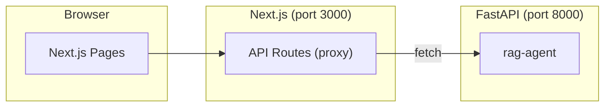

# DeepWiki Frontend

The DeepWiki frontend is the web UI for the MongoDB RAG Agent. It provides four user-facing surfaces: **Knowledge Wiki** generation, **Web Crawler**, **Save & Research** (Instapaper-style), and **Readings** browser. The app is a PWA with Android Share Target support.

## Overview

| Feature | Description |
|---------|-------------|
| **Knowledge Wiki** | Generate structured wikis from ingested documents. RAG-powered page generation with streaming, interactive Q&A, and Mermaid diagrams. |
| **Web Crawler** | Crawl URLs and ingest content into MongoDB. Submit jobs, configure depth/options, and monitor job status. |
| **Save & Research** | Instapaper-style save flow. Share URLs from other apps; auto-detects YouTube and extracts transcripts. |
| **Readings** | Browser for saved readings with thumbnails, tags, domains, summaries, and related links. |

## Prerequisites

- **Node.js** 18+ and npm
- **Backend** running at port 8000 (FastAPI `rag-agent`). The frontend proxies all API calls through Next.js to avoid CORS.

## Setup

```bash
cd frontend
cp .env.example .env
# Edit .env and set BACKEND_URL (default: http://localhost:8000)
npm install
```

### Environment Variables

| Variable | Description | Default |
|----------|-------------|---------|
| `BACKEND_URL` | FastAPI backend URL (used by Next.js API routes) | `http://localhost:8000` |
| `NEXT_PUBLIC_API_BASE` | Public API base for browser fetches (leave empty for same-origin) | `""` |

## Development

```bash
cd frontend
npm run dev
```

The app runs at **http://localhost:3000**.

Ensure the backend is running (`uv run uvicorn mdrag.interfaces.api.main:app --host 0.0.0.0 --port 8000`, or via Docker) before using the frontend.

## Production / Docker

The `wiki-frontend` service is defined in `docker-compose.yml`:

```yaml
wiki-frontend:
  build:
    context: ./frontend
    dockerfile: Dockerfile
  environment:
    BACKEND_URL: http://rag-agent:8000
    NEXT_PUBLIC_API_BASE: ""
  ports:
    - "3000:3000"
  depends_on:
    - rag-agent
```

Start all services:

```bash
docker-compose up -d
```

The frontend is available at **http://localhost:3000**.

## Pages

| Route | Description |
|-------|-------------|
| `/` | Home: Wiki title input, generate button, project cards |
| `/wiki/:id` | Wiki viewer: sidebar, streaming page content, Ask modal, export |
| `/wiki/projects` | List of wiki projects |
| `/crawler` | Web Crawler: URL input, config panel, job monitoring |
| `/save` | Share Target receiver. Auto-saves shared URLs; shows YouTube cards |
| `/readings` | Reading list with thumbnails, tags, domains |
| `/readings/:id` | Reading detail: YouTube embed, summary, key points, related links |

## Architecture



- All API calls go through Next.js API routes (`app/api/*`).
- Routes forward requests to the FastAPI backend.
- This avoids CORS and lets the frontend deploy independently.

### API Route Map

| Next.js Route | Backend Endpoint |
|---------------|------------------|
| `/api/wiki/structure` | `POST /api/v1/wiki/structure` |
| `/api/wiki/generate` | `POST /api/v1/wiki/generate` |
| `/api/wiki/chat` | `POST /api/v1/wiki/chat` |
| `/api/wiki/projects` | `GET /api/v1/wiki/projects` |
| `/api/ingest/web` | `POST /api/v1/ingest/web` |
| `/api/ingest/jobs/:id` | `GET /api/v1/ingest/jobs/:id` |
| `/api/readings/*` | `GET/POST /api/v1/readings/*` |

## PWA & Android Share Target

The `public/manifest.json` declares a `share_target`:

```json
{
  "action": "/save",
  "method": "GET",
  "params": { "title": "title", "text": "text", "url": "url" }
}
```

When installed via "Add to Home Screen" on Android Chrome, the app appears in the system share sheet. Shared URLs are received as query parameters on `/save` and automatically saved to the readings pipeline.

## Components

| Component | Purpose |
|-----------|---------|
| `WikiTreeView` | Collapsible section/page sidebar |
| `AskPanel` | Chat interface with streaming responses |
| `Markdown` | Rich markdown with Mermaid + syntax highlighting |
| `MermaidDiagram` | Dynamic Mermaid chart renderer |
| `CrawlJobCard` | Live crawl job status with polling |
| `ThemeToggle` | Light/dark mode |

## Build

```bash
cd frontend
npm run build
npm run start   # Production server
```

The build uses `output: "standalone"` for a minimal Docker image. The Dockerfile copies `.next/standalone` and `.next/static`.

## See Also

- [frontend/AGENTS.md](../frontend/AGENTS.md) - Agent guide with architecture and durable lessons
- [design-patterns/docker-compose.md](design-patterns/docker-compose.md) - Port mapping and Docker patterns
- [src/server/AGENTS.md](../src/server/AGENTS.md) - FastAPI backend API and services
