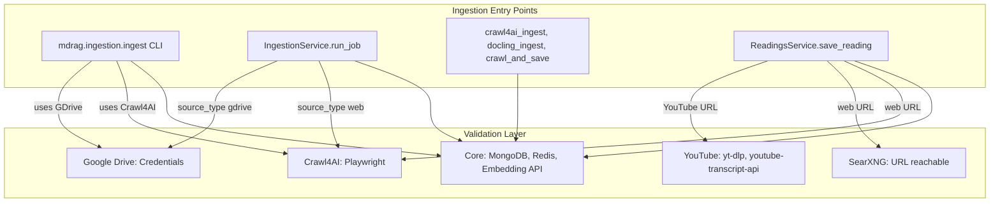

# Ingestion Pipeline Validation

## Overview

Validation is attached to the ingestion pipeline and runs before any collect/store. Core checks run for all ingest flows; collector-specific checks run only when that collector is used. Fail hard/noisily with actionable error messages.

## Architecture



## Core Checks (always)

- **MongoDB**: Connection (strict=False for ingestion; collections may not exist yet)
- **Embedding API**: Single test request
- **Redis + RQ workers**: When `require_redis=True` (queue-based flows). Validates Redis connection and that at least one RQ worker is listening to the `default` queue. Jobs will queue but never process without workers.

## Collector-Specific Checks

| Collector | Extra Checks |
|-----------|--------------|
| crawl4ai | Playwright installed |
| gdrive | Google credentials (service account file or GDOC_CLIENT/GDOC_TOKEN) |
| upload | None |

## ReadingsService Checks

For `save_reading`, validation depends on URL type:

- **web**: MongoDB, Redis, RQ workers, LLM API, Playwright, SearXNG
- **youtube**: MongoDB, Redis, RQ workers, LLM API, yt-dlp, youtube-transcript-api, SearXNG

## Validation Matrix

| Entry Point | Core | Crawl4AI | Google Drive | YouTube | SearXNG |
|-------------|------|----------|--------------|---------|---------|
| ingest CLI (crawl) | Mongo, Embed | Playwright | - | - | - |
| ingest CLI (drive) | Mongo, Embed | - | Credentials | - | - |
| ingest CLI (docs) | Mongo, Embed | - | - | - | - |
| Worker (web) | Mongo, Redis, Embed | Playwright | - | - | - |
| Worker (gdrive) | Mongo, Redis, Embed | - | Credentials | - | - |
| Worker (upload) | Mongo, Redis, Embed | - | - | - | - |
| ReadingsService (web) | Mongo, Redis, LLM | Playwright | - | - | SearXNG |
| ReadingsService (YouTube) | Mongo, Redis, LLM | - | - | yt-dlp, transcript-api | SearXNG |

Note: Redis + RQ workers are required when using the queue (crawl_and_save, ReadingsService, API ingest endpoints). For direct ingest CLI, Redis is optional. Start workers with: `uv run rq worker default --url redis://localhost:6379/0`

## Where Validation Runs

- **IngestionWorkflow.ingest_collector()**: Before `collector.collect()`; validates core + collector
- **ingest CLI main()**: Before processing; validates core + all requested collectors
- **IngestionService.run_job()**: After workflow.initialize(); validates core + collector for source_type
- **ReadingsService.save_reading()**: After initialize(); validates via `validate_readings(url_type, searxng_url)`

## Validation Functions (mdrag.validation)

- `validate_mongodb(settings, strict=True|False)` – connection; optionally collections + indexes
- `validate_redis(redis_url)` – Redis connection
- `validate_rq_workers(redis_url, queue_name="default")` – at least one worker listening to the queue
- `validate_embedding_api(settings)` – async; single embedding request
- `validate_playwright()` – subprocess `playwright --version`
- `validate_google_credentials(settings)` – service account file or GDOC_CLIENT/GDOC_TOKEN
- `validate_youtube_deps()` – imports yt_dlp, youtube_transcript_api
- `validate_searxng(searxng_url)` – HTTP GET to SearXNG
- `validate_llm_api(settings)` – LLM_API_KEY present

## Pipeline Validation (mdrag.ingestion.validation)

- `validate_ingestion(settings, collectors=[...], strict_mongodb=False, require_redis=True)` – core + collector checks
- `validate_readings(settings, url_type, searxng_url=...)` – ReadingsService flow

## Settings Usage

All validation must use Settings or config class. Pull:

- `redis_url` from `getattr(settings, "redis_url", "redis://localhost:6379/0")`
- `searxng_url` from `getattr(settings, "searxng_url", "http://localhost:7080")`

## Error Message Format

On failure, validation raises `ValidationError` with:

```
{Check} validation failed
  Reason: {detail}
  Setup: {actionable instructions}
```

## See Also

- [Document Ingestion](document_ingestion.md) - Ingestion pipeline architecture
- [Docker Compose Patterns](docker-compose.md) - Service configuration for validation dependencies

---

_Last updated: 2026-02-09_
