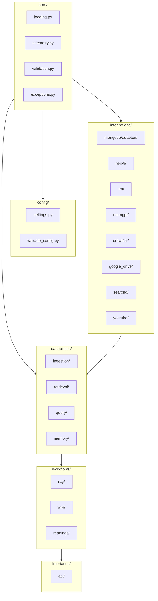

# Core Runtime (src) - Agent Guide

## Package Identity

Package `mdrag` maps to `src/`. Agentic RAG system with MongoDB Atlas Vector Search, capability-based ingestion, and multiple interfaces (CLI, FastAPI, MCP).

## Technical Stack

- **Framework**: Pydantic AI 0.1.x, LangGraph 0.2+
- **Language**: Python 3.10+
- **Key Dependencies**: PyMongo 4.10+, Motor, OpenAI SDK, Docling 2.14+, Rich 13.9+

## Architecture

### Layered Structure (Code as Source)



### Root-Level RAG Files (Legacy/Active)

- `agent.py` - Pydantic AI agent + search tools
- `tools.py` - semantic, text, hybrid search; `SearchResult`, `WebSearchResult`, `HasDeps`
- `prompts.py` - system prompts
- `cli.py` - streaming CLI
- `dependencies.py` - re-exports `AgentDependencies` from `workflows/rag/dependencies.py`

### Key Classes (from code)

| Class | Location | Purpose |
|-------|----------|---------|
| `AgentDependencies` | `workflows/rag/dependencies.py` | MongoDB, EmbeddingClient, LLM; injected into agent |
| `ManagedDependencies` | `interfaces/api/dependencies.py` | FastAPI lifecycle wrapper for AgentDependencies |
| `MDRAGException` | `core/exceptions.py` | Project-wide base exception |
| `ValidationError` | `core/validation.py` | MongoDB, Redis, embedding, etc. validation |
| `StorageAdapter` | `capabilities/ingestion/protocols.py` | Protocol; `MongoStorageAdapter` in integrations |

## JIT Index (Sub-AGENTS.md)

| Directory | AGENTS.md |
|-----------|-----------|
| `core/` | [core/AGENTS.md](core/AGENTS.md) |
| `config/` | [config/AGENTS.md](config/AGENTS.md) |
| `integrations/` | [integrations/AGENTS.md](integrations/AGENTS.md) |
| `capabilities/ingestion/` | [capabilities/ingestion/AGENTS.md](capabilities/ingestion/AGENTS.md) |
| `capabilities/retrieval/` | [capabilities/retrieval/AGENTS.md](capabilities/retrieval/AGENTS.md) |
| `capabilities/query/` | [capabilities/query/AGENTS.md](capabilities/query/AGENTS.md) |
| `capabilities/memory/` | [capabilities/memory/AGENTS.md](capabilities/memory/AGENTS.md) |
| `workflows/` | [workflows/AGENTS.md](workflows/AGENTS.md) |
| `interfaces/api/` | [interfaces/api/AGENTS.md](interfaces/api/AGENTS.md) |

## Import Paths (Canonical)

| Use | Import |
|-----|--------|
| Settings | `mdrag.settings` or `mdrag.config.settings` |
| Validation | `mdrag.validation` or `mdrag.core.validation` |
| Agent deps | `mdrag.dependencies` (re-exports `workflows.rag.dependencies`) |
| Ingestion | `mdrag.ingestion` (redirects to `capabilities.ingestion`) |
| Query | `mdrag.query` (redirects to `capabilities.query`) |
| Retrieval | `mdrag.retrieval` (redirects to `capabilities.retrieval`) |
| Storage adapter | `mdrag.integrations.mongodb.adapters.storage.MongoStorageAdapter` |

## Commands

```bash
# Validate config (MongoDB connection)
uv run python -m mdrag.config.validate_config

# Ingest documents
uv run python -m mdrag.ingestion.ingest -d ./documents

# Run CLI
uv run python -m mdrag.cli

# Run API
uv run uvicorn mdrag.interfaces.api.main:app
```

## Patterns & Conventions

- **DO**: Use `AgentDependencies` via `StateDeps` / `RAGState`; avoid per-call client creation.
- **DO**: Return `Source` with `SourceFrontmatter` from integrations.
- **DON'T**: Pass raw markdown into `HybridChunker`; use `DoclingDocument`.
- **DON'T**: Store embeddings as strings; use `list[float]` for MongoDB.
- **DON'T**: Skip `$lookup` for document metadata in search pipelines.

## Component Gotchas

1. Hybrid search uses manual RRF in `tools.py` (not `$rankFusion`).
2. `validate_mongodb(settings, strict=False)` for ingestion; `strict=True` for query/CLI/server.
3. Ingestion validation: `validate_ingestion()` at pipeline entry; collector-specific checks (Playwright, credentials).
4. Use `mdrag.validation` for startup checks; layer-specific validators live in their modules.
