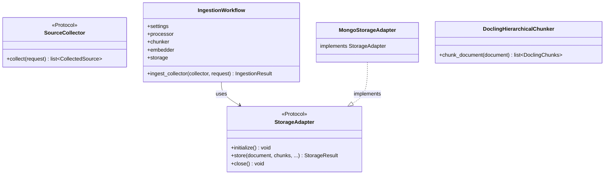
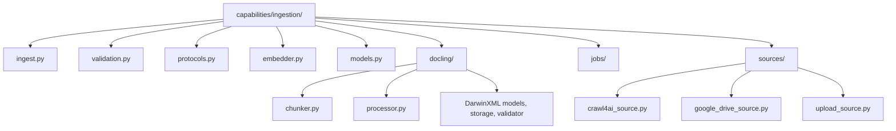
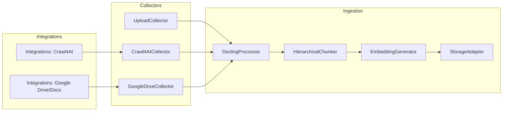

# Ingestion Capability (src/capabilities/ingestion)

## Purpose

Document conversion, chunking, embedding, and storage orchestration. Defines protocols (`StorageAdapter`, `SourceCollector`, `IngestionProcessor`); MongoDB adapter lives in `integrations/mongodb/adapters/storage.py`.

## Technical Stack

- Docling 2.14+ (HierarchicalChunker, processor)
- Transformers (tokenizer)
- OpenAI SDK (embeddings via `EmbeddingGenerator`)

## Architecture

### Class Overview



### Folder Map (capabilities/ingestion)



### Code Examples

✅ DO: Chunk with an IngestionDocument
- Example in `capabilities/ingestion/ingest.py`: chunker.chunk_document(document)

❌ DON'T: Pass raw markdown into HierarchicalChunker
- Anti-pattern: chunker.chunk(dl_doc=markdown_text)

❌ DON'T: Put storage adapter in capabilities; it lives in `integrations/mongodb/adapters/`

### Domain Dictionary
- CollectedSource: standardized handoff from collection layer
- IngestionDocument: Docling-converted document with identity metadata
- DoclingChunks: chunk with metadata + embedding
- StorageRepresentations: canonical outputs for storage adapters

## Integration → Ingestion Workflows

The ingestion workflow pulls content from collectors, normalizes into
CollectedSource, converts via Docling, chunks, embeds, and stores.



**Workflow details**
1. **Collector** in `capabilities/ingestion/sources/*` returns `CollectedSource`.
2. **DoclingProcessor** converts into `IngestionDocument`.
3. **Chunking** produces `DoclingChunks` with passport metadata.
4. **Embeddings** add vectors to each chunk.
5. **Storage adapter** (e.g. `MongoStorageAdapter` in `integrations/mongodb/adapters/storage.py`) persists documents/chunks.

## Key Files & JIT Search

### Touch Points
- Workflow: `capabilities/ingestion/ingest.py`
- Chunking: `capabilities/ingestion/docling/chunker.py`
- Conversion: `capabilities/ingestion/docling/processor.py`
- Storage adapter: `integrations/mongodb/adapters/storage.py` (`MongoStorageAdapter`)
- Collectors: `capabilities/ingestion/sources/`

### Search Commands
```
rg "class DoclingHierarchicalChunker" src/capabilities/ingestion
rg "class MongoStorageAdapter" src/integrations
```

## Pre-Ingest Validation

Validation is attached to the ingestion pipeline and runs before any collect/store. See [docs/design-patterns/ingestion-validation.md](../../docs/design-patterns/ingestion-validation.md) for full architecture and validation matrix.

### Core Checks (always)
- MongoDB connection (strict=False for ingestion; collections may not exist yet)
- Embedding API (single test request)
- Redis + RQ workers (when `require_redis=True`, e.g. crawl_and_save, ReadingsService, API ingest). At least one worker must be listening to `default` queue.

### Collector-Specific Checks

| Collector | Extra Checks |
|-----------|--------------|
| crawl4ai | Playwright installed |
| gdrive | Google credentials (service account file or GDOC_CLIENT/GDOC_TOKEN) |
| upload | None |

### Where Validation Runs

- **IngestionWorkflow.ingest_collector()**: Before `collector.collect()`; validates core + collector
- **ingest CLI main()**: Before processing; validates core + all requested collectors
- **IngestionService.run_job()**: After workflow.initialize(); validates core + collector for source_type
- **ReadingsService.save_reading()**: After initialize(); validates via `validate_readings(url_type, searxng_url)` — MongoDB, Redis, LLM API, plus Playwright/SearXNG (web) or yt-dlp/youtube-transcript-api (YouTube)

### validate_readings (ReadingsService)

For `save_reading`, validation depends on URL type:
- **web**: Playwright, SearXNG
- **youtube**: yt-dlp, youtube-transcript-api

## Testing & Validation

Design details: [docs/design-patterns/ingestion-validation.md](../../docs/design-patterns/ingestion-validation.md)

### Test Command
- uv run python -m mdrag.ingestion.ingest -d ./documents

### Test Strategy
- Unit: chunker output shape and metadata
- Integration: ingest sample documents into MongoDB

### Test Locations
- sample/ingestion/ (pipeline validation)
- tests/ (protocol checks)

## Component Gotchas

1. Docling processing requires file-based inputs; collectors must materialize.
2. DoclingChunks must carry `document_uid` for cross-store linkage.
3. Embeddings must be list[float] for MongoDB vector search.
4. Use source_mask for filter compatibility in retrieval.
5. Ingestion is non-destructive by default; use --no-clean to skip cleanup.
