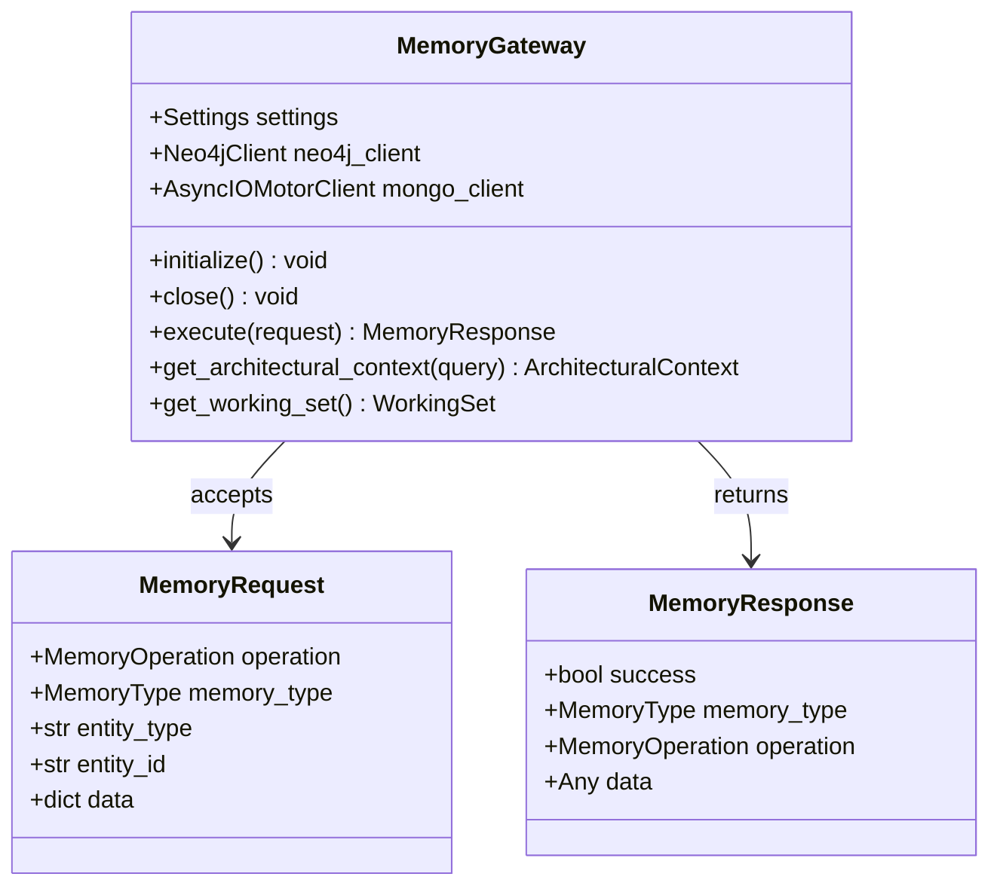
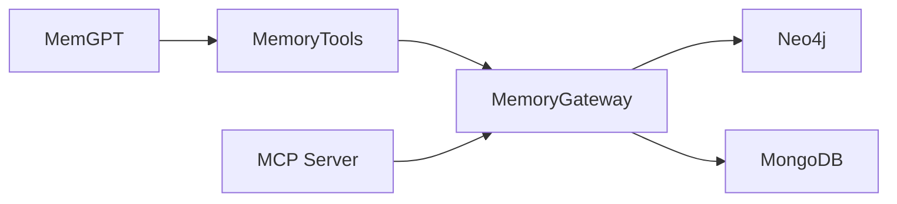

# Memory Capability (src/capabilities/memory)

## Purpose

Unified interface for NeuralCursor Second Brain: Neo4j (structural graph) + MongoDB (episodic). Used by MemGPT integration and MCP server. Memory is a capability; Neo4j and MemGPT are integrations.

## Architecture

### Class Overview



### Process Flow



## Key Files

| File | Contents |
|------|----------|
| `gateway.py` | `MemoryGateway` — execute(), get_architectural_context(), get_working_set() |
| `models.py` | `MemoryRequest`, `MemoryResponse`, `MemoryType`, `ArchitecturalContext`, `WorkingSet` |
| `exceptions.py` | `MemoryError` (subclasses `MDRAGException`) |

## Patterns

- **DO**: Use `MemoryGateway` via async context manager (`async with gateway:`).
- **Memory type**: `STRUCTURAL` (Neo4j), `EPISODIC` (MongoDB), `HYBRID` (both).
- **DON'T**: Create Neo4j clients directly in workflows; use MemoryGateway.

## JIT Search

```
rg "class MemoryGateway" src/capabilities/memory
rg "MemoryGateway" src
```
