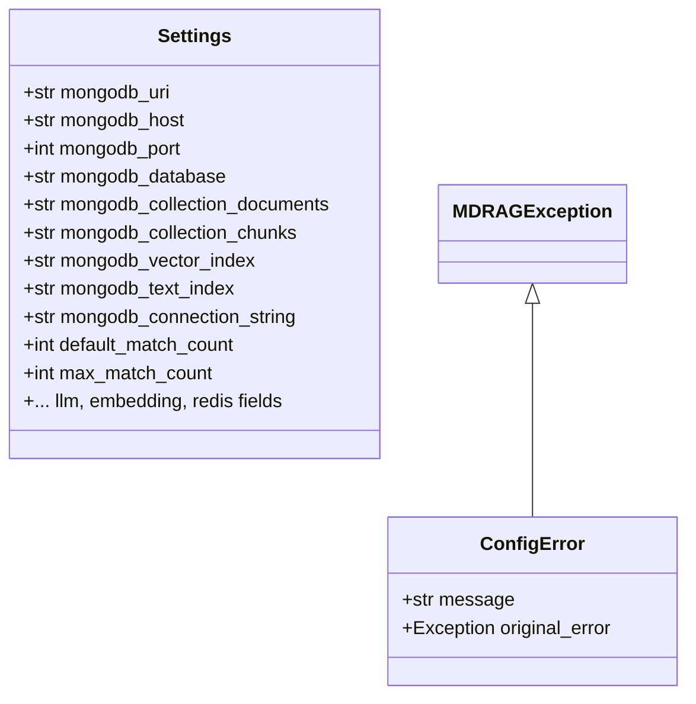
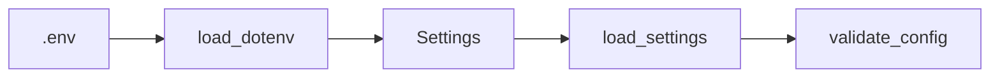

# Config Layer (src/config)

## Purpose

Bootstrap configuration: Pydantic Settings, env loading, and config validation entry point. No runtime business logic.

## Architecture

### Class Overview



### Process Flow



## Key Files

| File | Contents |
|------|----------|
| `settings.py` | `Settings` (BaseSettings), `load_settings()` |
| `validate_config.py` | Entry point: `uv run python -m mdrag.config.validate_config` |
| `exceptions.py` | `ConfigError` (subclasses `MDRAGException`) |

## Commands

```bash
# Validate config (MongoDB connection, env vars)
uv run python -m mdrag.config.validate_config
```

## Patterns

- **DO**: Use `load_settings()` for runtime config; avoid ad-hoc env reads.
- **DO**: Add new config fields to `Settings` with `Field(description=...)`.
- **DON'T**: Hardcode connection strings; use `Settings.mongodb_connection_string`.

## JIT Search

```
rg "class Settings" src/config
rg "load_settings" src
```
