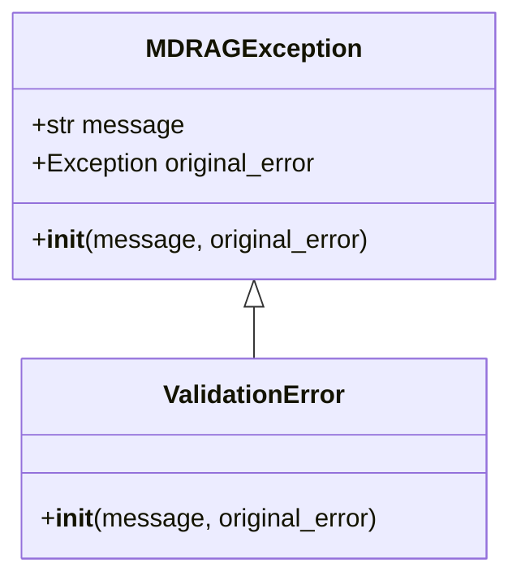
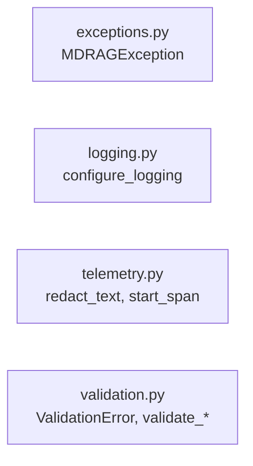

# Core Layer (src/core)

## Purpose

Cross-cutting infrastructure: logging, telemetry (PII redaction, tracing), validation, and base exceptions. No business logic.

## Architecture

### Class Overview



### Module Map



## Key Files

| File | Contents |
|------|----------|
| `exceptions.py` | `MDRAGException` — project-wide base exception |
| `logging.py` | `configure_logging()` — console logging setup |
| `telemetry.py` | `redact_text`, `redact_payload`, `start_span`, `new_trace_id` — PII + OTEL |
| `validation.py` | `ValidationError`; `validate_mongodb`, `validate_neo4j`, `validate_rq_workers`, `validate_vllm`, `validate_embedding_api`, etc. |

## Validation Functions (from code)

| Function | Purpose |
|----------|---------|
| `validate_mongodb(settings, strict=True)` | Connection + collections/indexes when strict |
| `validate_neo4j(uri, username, password, database)` | Neo4j connection/auth |
| `validate_rq_workers(redis_url, queue_name)` | RQ worker listening |
| `validate_vllm(reasoning_url, embedding_url, api_key)` | vLLM health |
| `validate_embedding_api(settings)` | Single embedding test |
| `validate_playwright()` | Playwright installed |
| `validate_google_credentials(settings)` | Google Drive credentials |
| `validate_youtube_deps()` | yt-dlp, youtube-transcript-api |
| `validate_searxng(searxng_url)` | SearXNG reachable |
| `validate_llm_api(settings)` | LLM provider reachable |

## Patterns

- **DO**: Subclass `MDRAGException` for project-specific exceptions.
- **DO**: Use `strict=False` for ingestion validation (connection only).
- **DON'T**: Run `list_collection_names` when `strict=False`; can fail on replica sets.

## JIT Search

```
rg "class MDRAGException" src/core
rg "def validate_" src/core
```
