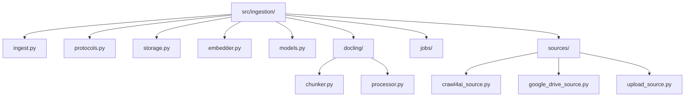
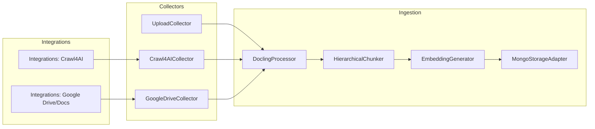

# Ingestion Pipeline (src/ingestion) - Agent Guide

## Technical Stack
- Framework: Docling 2.14+ (document conversion + HierarchicalChunker)
- Language: Python 3.10+
- Key Dependencies:
  - Transformers - tokenizer for HierarchicalChunker
  - OpenAI SDK - embeddings
  - PyMongo 4.10+ - async ingestion writes

## Architecture & Patterns

### File Organization
- ingest.py - ingestion workflow orchestration + CLI
- protocols.py - capability interfaces (collectors, processors, storage)
- storage.py - MongoDB storage adapter
- docling/processor.py - Docling conversion (no collection logic)
- docling/chunker.py - Docling chunking
- embedder.py - batch embeddings for chunks

### Folder Map (src/ingestion)

### Code Examples

✅ DO: Chunk with an IngestionDocument
- Example in src/ingestion/ingest.py: chunker.chunk_document(document)

❌ DON'T: Pass raw markdown into HierarchicalChunker
- Anti-pattern: chunker.chunk(dl_doc=markdown_text)

### Domain Dictionary
- CollectedSource: standardized handoff from collection layer
- IngestionDocument: Docling-converted document with identity metadata
- DoclingChunks: chunk with metadata + embedding
- StorageRepresentations: canonical outputs for storage adapters

## Integration → Ingestion Workflows

The ingestion workflow pulls content from collectors, normalizes into
CollectedSource, converts via Docling, chunks, embeds, and stores.

**Workflow details**
1. **Collector** in `src/ingestion/sources/*` returns `CollectedSource`.
2. **DoclingProcessor** converts into `IngestionDocument`.
3. **Chunking** produces `DoclingChunks` with passport metadata.
4. **Embeddings** add vectors to each chunk.
5. **Storage adapter** persists documents/chunks and optional DarwinXML metadata.

## Key Files & JIT Search

### Touch Points
- Workflow: src/ingestion/ingest.py
- Chunking: src/ingestion/docling/chunker.py
- Conversion: src/ingestion/docling/processor.py
- Storage: src/ingestion/storage.py
- Collectors: src/ingestion/sources/

### Search Commands
- /bin/grep -R "class DoclingHierarchicalChunker" -n src/ingestion
- /bin/grep -R "class MongoStorageAdapter" -n src/ingestion

## Testing & Validation

### Test Command
- uv run python -m src.ingestion.ingest -d ./documents

### Test Strategy
- Unit: chunker output shape and metadata
- Integration: ingest sample documents into MongoDB

### Test Locations
- sample/ingestion/ (pipeline validation)
- tests/ (protocol checks)

## Component Gotchas

1. Docling processing requires file-based inputs; collectors must materialize.
2. DoclingChunks must carry `document_uid` for cross-store linkage.
3. Embeddings must be list[float] for MongoDB vector search.
4. Use source_mask for filter compatibility in retrieval.
5. Ingestion is non-destructive by default; use --no-clean to skip cleanup.
