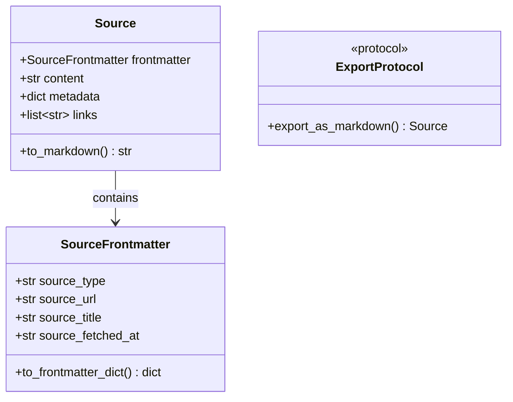
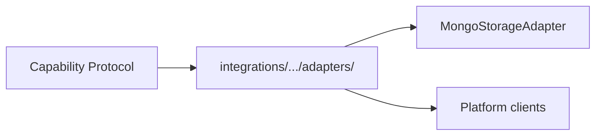

# Integrations Layer (src/integrations)

## Purpose

External platform adapters: databases, LLM providers, content sources. Each integration normalises output into the shared `Source` / `SourceFrontmatter` contract for ingestion. Capabilities define protocols; integrations provide implementations.

## Architecture

### Integration ↔ Capability Mapping

| Capability | Integrations |
|------------|--------------|
| **Ingestion** | MongoDB (storage), Neo4j (DarwinXML/graph), Crawl4AI, Google Drive, SearXNG, YouTube |
| **Memory** | Neo4j (graph), MemGPT |
| **Retrieval** | MongoDB (vector search), Neo4j |

### Shared Contracts (models.py)



### Adapter Structure



## Modules (from code)

| Module | Responsibility | Key Class |
|--------|---------------|-----------|
| `mongodb/adapters/storage.py` | Ingestion storage | `MongoStorageAdapter` (implements `StorageAdapter`) |
| `neo4j/` | Graph storage for memory | Neo4jClient |
| `llm/` | Completion, embeddings, vLLM | `LLMCompletionClient`, `VLLMClient`, `get_llm_model` |
| `memgpt/` | MemGPT/Letta agent framework | `MemGPTWrapper`, `MemoryTools` |
| `crawl4ai/` | Headless browser web crawling | `Crawl4AIClient` |
| `google_drive/` | Google Drive/Docs export | `GoogleDriveClient` |
| `youtube/` | YouTube transcript + metadata | `YouTubeExtractor` |
| `searxng/` | Web meta-search | Router |
| `models.py` | Shared `Source`, `SourceFrontmatter`, `ExportProtocol` | — |
| `exceptions.py` | `IntegrationError` (base) | — |

## Durable Lessons

1. **Normalise early.** Every content integration returns `Source` with `SourceFrontmatter`. This decouples collection from ingestion.

2. **Protocol in capability, adapter in integration.** `StorageAdapter` is defined in `capabilities/ingestion/protocols.py`; `MongoStorageAdapter` lives in `integrations/mongodb/adapters/storage.py`.

3. **Fallback chains are essential.** Crawl4AI falls back Playwright → httpx + BeautifulSoup. YouTube: youtube-transcript-api → yt-dlp → oEmbed.

4. **Media-type detection at the edge.** `is_youtube_url()` routes to the YouTube extractor; add new detectors in ReadingsService.

## JIT Search

```
rg "class MongoStorageAdapter" src/integrations
rg "class Source" src/integrations/models.py
rg "IntegrationError" src/integrations
```
