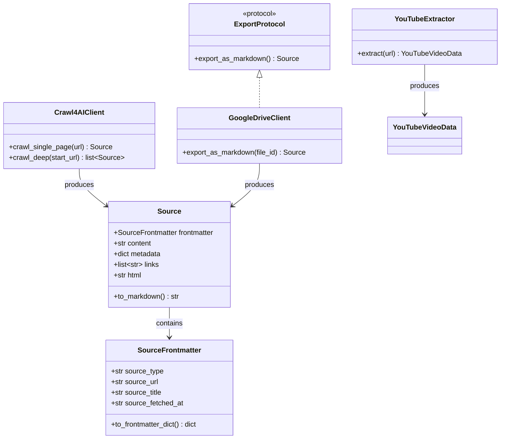

# Integrations Layer (src/integrations) - Agent Guide

## Purpose

External service adapters that collect content from the outside world. Each integration normalises its output into the shared `Source` / `SourceFrontmatter` contract so the ingestion pipeline doesn't care where data came from.

## Architecture



## Modules

| Module | Responsibility | Key Class |
|--------|---------------|-----------|
| `crawl4ai/` | Headless browser web crawling | `Crawl4AIClient` |
| `google_drive/` | Google Drive/Docs export | `GoogleDriveClient` |
| `youtube/` | YouTube transcript + metadata extraction | `YouTubeExtractor` |
| `searxng/` | Web meta-search via SearXNG | FastAPI router |
| `models.py` | Shared `Source` / `SourceFrontmatter` contract | `Source` |

## Durable Lessons

1. **Normalise early.** Every integration returns `Source` with `SourceFrontmatter`. This decouples collection from ingestion. If you add a new integration, return `Source` and the rest of the pipeline just works.

2. **Frontmatter is the metadata passport.** `SourceFrontmatter` carries provenance (source_type, source_url, timestamps) that follows data all the way into MongoDB chunks. Never discard it.

3. **Fallback chains are essential.** Crawl4AI can fail (JavaScript-heavy sites, timeouts). The crawler falls back from Playwright → httpx + BeautifulSoup. YouTube extraction falls back from youtube-transcript-api → yt-dlp → oEmbed. Always have a degraded-but-functional path.

4. **No API keys for read-only extraction.** YouTube oEmbed, youtube-transcript-api, and yt-dlp all work without API keys. This is by design — the platform should ingest content without users managing third-party credentials.

5. **Media-type detection at the edge.** The `is_youtube_url()` helper detects YouTube links at save time so the pipeline routes to the right extractor. URL pattern matching (`youtu.be`, `youtube.com/watch`, `/shorts/`, `/embed/`) must cover all variants.

## Search Commands

```
grep -rn "class Crawl4AIClient" src/integrations
grep -rn "class YouTubeExtractor" src/integrations
grep -rn "class Source" src/integrations/models.py
```
