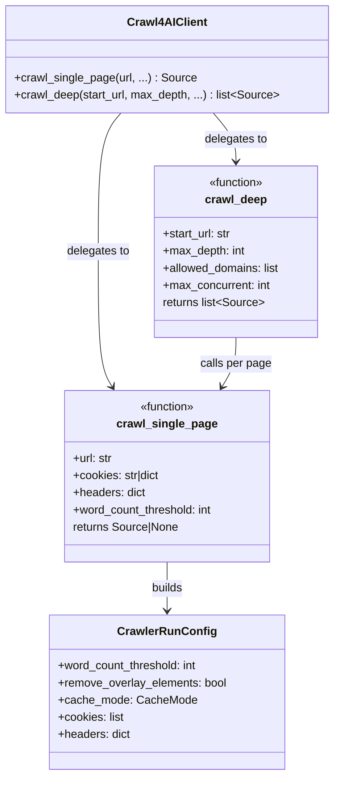
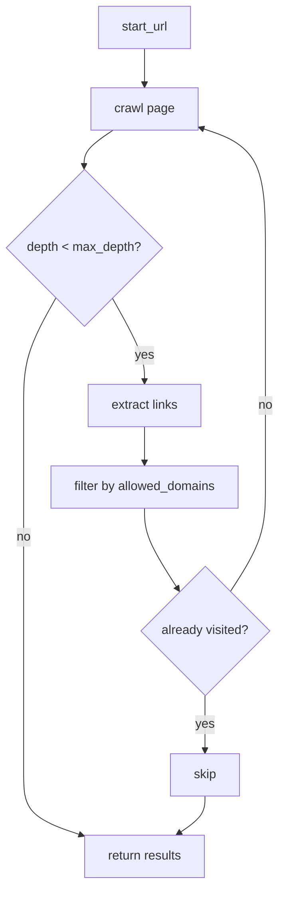

# Crawl4AI Integration (src/integrations/crawl4ai) - Agent Guide

## Purpose

Headless browser web crawling with Playwright. Supports single-page extraction and recursive deep crawling with domain scoping.

## Architecture

## Deep Crawl Flow

## Durable Lessons

1. **Managed crawler context.** `_with_crawler()` ensures `AsyncWebCrawler` is properly entered/exited. If a caller provides one, it's reused; otherwise a temporary one is created. This prevents resource leaks.

2. **Cookie authentication.** `_parse_cookies()` converts `"name=value; name2=value2"` strings into Playwright-compatible cookie dicts with domain prefixed by `.` for subdomain matching.

3. **Domain scoping is automatic.** `crawl_deep` defaults `allowed_domains` to the start URL's domain. External links are filtered out unless explicitly allowed.

4. **Concurrency semaphore.** Deep crawl uses `asyncio.Semaphore(max_concurrent)` to cap parallel browser tabs. Default is 10.

5. **httpx fallback for non-JS pages.** When Playwright fails, `crawl_single_page` falls back to a simple httpx GET + BeautifulSoup parse. This handles CDN-served docs and static sites where a full browser is unnecessary.
