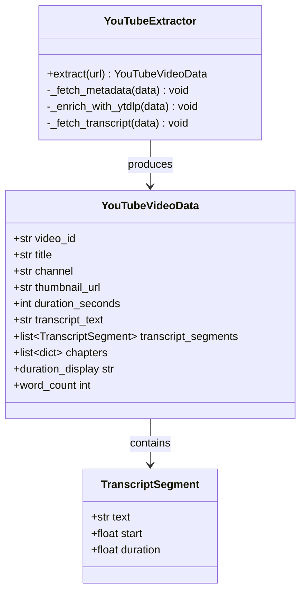
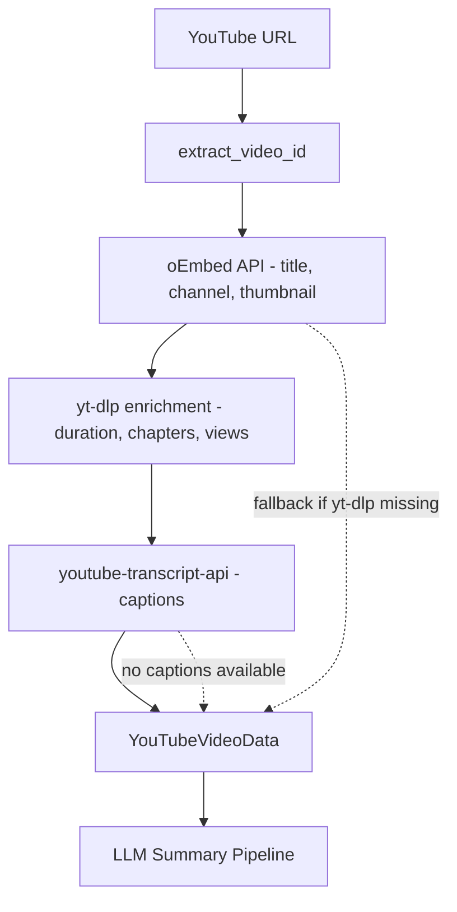

# YouTube Integration (src/integrations/youtube) - Agent Guide

## Purpose

Extract video metadata and transcripts from YouTube without API keys. Feeds into the save-and-research pipeline for video summarisation.

## Architecture

## Extraction Pipeline

## Durable Lessons

1. **Three-layer metadata strategy.** oEmbed is fast and reliable for basic metadata. yt-dlp adds duration, chapters, and view counts but is heavier. Layer them so the fast path always returns something.

2. **Transcript language fallback.** Try explicit English variants first (`en`, `en-US`, `en-GB`), then iterate `list_transcripts()` for any available language. Prefer manually-created over auto-generated.

3. **URL normalisation matters.** YouTube has 5+ URL formats. The `_YT_PATTERNS` regex array handles `watch?v=`, `youtu.be/`, `/embed/`, `/v/`, and `/shorts/`. Always extract the 11-char video ID and rebuild the canonical URL.

4. **Thread offloading.** Both yt-dlp and youtube-transcript-api are synchronous. Wrap them in `asyncio.to_thread()` to avoid blocking the event loop.

5. **Chapters are timestamped navigation.** When chapters exist, include them in the content fed to the LLM — they provide structural context that improves summarisation quality.
