# Core Runtime (src) - Agent Guide

## Technical Stack
- Framework: Pydantic AI 0.1.x
- Language: Python 3.10+
- Key Dependencies:
  - PyMongo 4.10+ - async MongoDB client
  - OpenAI SDK - embeddings
  - Rich 13.9+ - CLI rendering

## Architecture & Patterns

### File Organization
- agent.py - Pydantic AI agent + search tool
- tools.py - semantic/text/hybrid search pipelines
- dependencies.py - MongoDB + embedding clients
- settings.py - Pydantic Settings config
- providers.py - LLM/embedding model provider setup
- prompts.py - system prompts
- cli.py - streaming CLI

### Folder Map (src)

```mermaid
flowchart TB
  src_root[src/]
  src_root --> agent_py[agent.py]
  src_root --> tools_py[tools.py]
  src_root --> dependencies_py[dependencies.py]
  src_root --> settings_py[settings.py]
  src_root --> providers_py[providers.py]
  src_root --> prompts_py[prompts.py]
  src_root --> cli_py[cli.py]
  src_root --> ingestion[src/ingestion/]
  src_root --> integrations[src/integrations/]
  src_root --> retrieval[src/retrieval/]
  src_root --> server[src/server/]
  src_root --> logging[src/logging/]
  src_root --> observability[src/observability/ - LangSmith tracing]
  src_root --> logging_config[logging_config.py]
  src_root --> query_py[query.py]
  src_root --> test_config_py[test_config.py]
```

**Folder responsibilities**
- ingestion/ - document conversion, chunking, embeddings, ingestion pipeline.
- integrations/ - external service clients (Crawl4AI, Google Drive/Docs, SearXNG).
- retrieval/ - vector store + embeddings utilities for retrieval flows.
- server/ - FastAPI app and API wiring.
- logging/ - structured logging helpers and context utilities.
- observability/ - PII handling + tracing utilities (LangSmith).

### Code Examples

✅ DO: Initialize and ping MongoDB in AgentDependencies
- Example in src/dependencies.py (initialize): await self.mongo_client.admin.command("ping")

❌ DON'T: Skip document metadata join in search pipelines
- Anti-pattern: returning chunks without $lookup to documents
❌ DON'T: Recreate AgentDependencies per tool call
- Anti-pattern: building new clients instead of reusing `StateDeps` in src/agent.py

### Domain Dictionary
- Document: source record stored in documents collection
- Chunk: searchable unit in chunks collection with embedding
- Hybrid search: RRF merge of vector + text searches

## Service Composition
- Not used in this component.

## Key Files & JIT Search

### Touch Points
- Agent tool: src/agent.py
- Search pipelines: src/tools.py
- Configuration: src/settings.py

### Search Commands
- /bin/grep -R "def search_knowledge_base" -n src
- /bin/grep -R "class SearchResult" -n src

## Testing & Validation

### Test Command
- uv run python -m src.test_config

### Test Strategy
- Unit: Validate settings, tool outputs formatting
- Integration: Run CLI with live MongoDB + embeddings

### Test Locations
- sample/ (integration and E2E checks)
- tests/ (pytest checks)

## Component Gotchas

1. Use async I/O for MongoDB and OpenAI calls.
2. Tool functions should return strings for LLM consumption.
3. Match count must respect settings.max_match_count.
4. Manual RRF is in src/tools.py; do not assume $rankFusion.
5. Reuse `AgentDependencies` via `StateDeps`; avoid per-call client creation.
6. Integration exports must return `ExtractSource` with `ExtractFrontmatter` (see src/mdrag/integrations/models.py).
