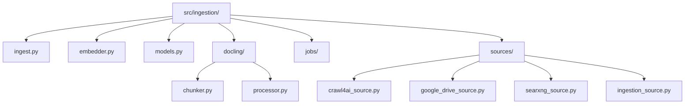
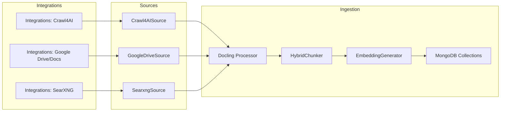

# Ingestion Pipeline (src/ingestion) - Agent Guide

## Technical Stack
- Framework: Docling 2.14+ (document conversion + HybridChunker)
- Language: Python 3.10+
- Key Dependencies:
  - Transformers - tokenizer for HybridChunker
  - OpenAI SDK - embeddings
  - PyMongo 4.10+ - async ingestion writes

## Architecture & Patterns

### File Organization
- ingest.py - end-to-end ingestion pipeline
- docling/chunker.py - Docling HybridChunker wrapper
- docling/processor.py - Docling document conversion
- embedder.py - batch embeddings for chunks
- server/maintenance/init_indexes.py - index initialization helpers (if used)

### Folder Map (src/ingestion)

### Code Examples

✅ DO: Pass DoclingDocument into chunker
- Example in src/ingestion/ingest.py: chunker.chunk_document(..., docling_doc=docling_doc)

❌ DON'T: Pass raw markdown into HybridChunker
- Anti-pattern: chunker.chunk(dl_doc=markdown_text)

### Domain Dictionary
- DoclingDocument: structured document from Docling converter
- DoclingChunks: chunk with metadata and optional embedding
- HybridChunker: token-aware chunking with context

## Integration → Ingestion Workflows

The ingestion pipeline pulls content from integrations, normalizes it into `Source` objects with `SourceFrontmatter`, then converts, chunks, embeds, and stores it.

**Workflow details**
1. **Integration client** in `src/integrations/*` fetches or exports content.
2. **Source adapter** in `src/ingestion/sources/*` wraps content into `Source` + `SourceFrontmatter`.
3. **Docling processor** converts to `DoclingDocument` for structure-aware conversion.
4. **Chunking** uses `DoclingHybridChunker` to produce `DoclingChunks` with metadata.
5. **Embeddings** are generated in `embedder.py` and stored as list[float].
6. **Storage** writes documents and chunks to MongoDB collections with upsert-based deduplication.

## Service Composition
- Not used in this component.

## Key Files & JIT Search

### Touch Points
- Pipeline: src/ingestion/ingest.py
- Chunking: src/ingestion/docling/chunker.py
- Docling conversion: src/ingestion/docling/processor.py
- Embeddings: src/ingestion/embedder.py

### Search Commands
- /bin/grep -R "class DoclingHybridChunker" -n src/ingestion
- /bin/grep -R "class EmbeddingGenerator" -n src/ingestion

## Testing & Validation

### Test Command
- uv run python -m src.ingestion.ingest -d ./documents

### Test Strategy
- Unit: chunker output shape and metadata
- Integration: ingest sample documents into MongoDB

### Test Locations
- sample/ingestion/ (pipeline validation)
- tests/ (protocol checks)

## Component Gotchas

1. Audio transcription requires Path objects for Docling.
2. HybridChunker needs DoclingDocument; fallback is last resort.
3. Embeddings must be list[float] for MongoDB vector search.
4. Chunk sizes should respect embedding model token limits.
5. Ingestion is non-destructive by default; use `--clean` to wipe collections.
6. Ingestion sources should preserve `SourceFrontmatter` on export.
