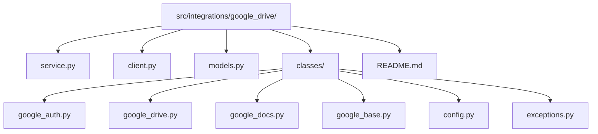

# Google Drive Integration - Usage Guide

## Intended Usage
- Use the high-level facade in src/integrations/google_drive/service.py for most calls.
- Treat low-level classes in src/integrations/google_drive/classes/ as internal building blocks.
- Always use async APIs; these clients are designed for async workflows.

## Component Map

**Folder responsibilities**
- classes/ - low-level API wrappers and auth/config utilities.
- service.py - public facade for search/export workflows.
- client.py - convenience client wiring for service usage.
- models.py - Drive/Docs response models.

## Primary Entry Point
- GoogleDriveService is the supported public API for search, export, and downloads.
- It composes GoogleDrive (Drive API) and GoogleDoc (Docs API).

## Credentials & Configuration
- Preferred env vars:
  - GDOC_CLIENT and GDOC_TOKEN for JSON credentials.
  - GOOGLE_CLIENT_ID and GOOGLE_CLIENT_SECRET for split credentials.
- Avoid logging or committing any credential values.

## Common Workflows
- Search for files by query and optional folder scoping.
- Export Google Docs as markdown with optional YAML frontmatter.
- Export Google Docs tabs when Docs API tab data is available.
- Download binary files directly (e.g., models, images).

## Do / Don’t
- DO call GoogleDriveService.search_files/search_documents/search_document_ids.
- DO call GoogleDriveService.export_as_markdown for normal document export.
- DO call GoogleDriveService.export_tabs for tabbed Docs when needed.
- DO ensure exports return `Source` with `SourceFrontmatter`.
- DON’T call GoogleDrive.Search or GoogleDrive.Export directly unless extending behavior.
- DON’T bypass GoogleAuth; it centralizes credential loading and refresh.

## Error Handling Expectations
- GoogleDriveException subclasses signal Drive/Docs API failures.
- Surface user-friendly errors at the call site; keep raw exceptions for logs.

## Key Files
- src/integrations/google_drive/service.py: facade usage surface.
- src/integrations/google_drive/classes/google_drive.py: Drive API low-level wrapper.
- src/integrations/google_drive/classes/google_docs.py: Docs API wrapper and tab export.
- src/integrations/google_drive/classes/google_auth.py: credential handling and refresh.
- src/integrations/google_drive/models.py: response models for Drive and Docs results.

## Example Usage References
- sample/google_drive/sample_folder.py
- sample/google_drive/single_file/download_single_doc.py

## Search Hints
- Find the facade methods: rg -n "class GoogleDriveService" src/integrations/google_drive
- Find Docs tab export: rg -n "export_tabs" src/integrations/google_drive
- Find Drive search: rg -n "class Search" src/integrations/google_drive/classes/google_drive.py
