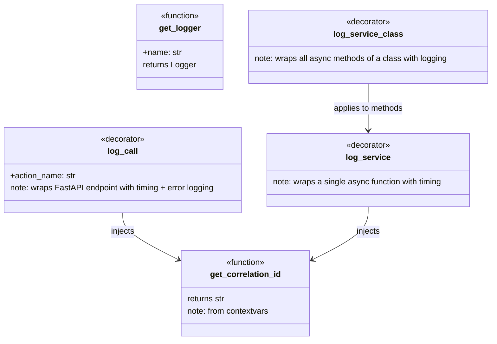

# Logging Layer (src/mdrag_logging) - Agent Guide

## Purpose

Centralized async logging with dc_logger, correlation ID injection, and decorator-based call tracing. Single source of truth for all server logging.

## Architecture

## Durable Lessons

1. **One logger factory.** Always use `get_logger(__name__)` from this module. Never call `logging.basicConfig()` elsewhere — it creates inconsistent formats.

2. **Correlation IDs tie requests together.** `get_correlation_id()` reads from `contextvars`. Set it once per request (middleware) and every log in the call chain carries it.

3. **Decorators over manual logging.** `@log_call` for API endpoints, `@log_service` for service functions, `@log_service_class` for entire classes. They capture timing, arguments, results, and errors automatically.

4. **Async-native.** dc_logger is async. The logging decorators await log calls. Never use synchronous `logger.info()` in async code paths without `log_async()`.
