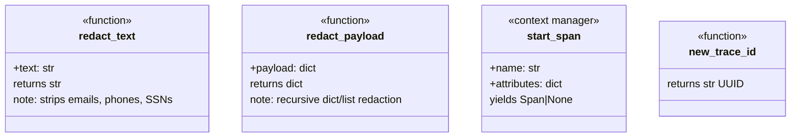

# Observability Layer (src/observability) - Agent Guide

## Purpose

PII redaction and distributed tracing. Ensures no personal data leaks into logs/traces and provides span-based instrumentation.

## Architecture

## Durable Lessons

1. **Redaction before storage.** Every trace record passes through `redact_payload()` before hitting MongoDB. This is non-negotiable for compliance.

2. **PII patterns are regex-based.** Email, phone, and SSN regexes cover common US formats. If you operate in other locales, extend the patterns.

3. **OpenTelemetry is optional.** `start_span()` gracefully no-ops when `opentelemetry` is not installed. This lets the codebase run without OTEL infrastructure while being instrumentation-ready.

4. **Trace IDs are UUIDs, not OTEL IDs.** `new_trace_id()` returns a UUID string, not an OTEL trace ID. This simplifies storage and cross-referencing in MongoDB.
