# Query Layer (src/query) - Agent Guide

## Purpose

Grounded query execution: retrieve context, generate answers, verify citations, and store traces. This is the core RAG read path that the API and CLI both use.

## Architecture

```mermaid
classDiagram
    class QueryService {
        +AgentDependencies deps
        +answer_query(query, search_type, ...) dict
        +close() void
        -_generate_answer(prompt) tuple
        -_verify_grounding(answer, results) GroundingResult
        -_store_trace(record) void
        -_store_feedback(trace_id, rating, comment) void
    }

    class GroundingResult {
        +bool grounded
        +float max_similarity
        +list~int~ missing_citations
    }

    class SearchResult {
        +str chunk_id
        +str content
        +float similarity
        +str document_title
    }

    QueryService --> GroundingResult : produces
    QueryService --> SearchResult : consumes
    QueryService --> AgentDependencies : uses
```

## Query Pipeline

## Durable Lessons

1. **Grounding is dual-signal.** A response is "grounded" when cosine similarity >= 0.75 AND all expected citation numbers appear in the text. Either failing triggers the warning banner.

2. **Trace everything.** Every query stores a trace document with the query, answer, citations, retrieval metadata, grounding scores, latency, and token usage. This is how you debug and evaluate.

3. **Implicit correction detection.** If a follow-up query starts with "no,", "actually", or "not ", it's flagged as a correction and negative feedback (-1) is stored against the parent trace. This creates a self-improving signal.

4. **The service owns its lifecycle.** `QueryService.__init__` creates `AgentDependencies`, `answer_query` calls `initialize()`, and the caller must call `close()`. Use try/finally.

5. **Search type selection matters.** "hybrid" merges vector + text via manual RRF. Use "semantic" for conceptual/vague queries, "text" for exact keyword matches, "hybrid" for general-purpose.
