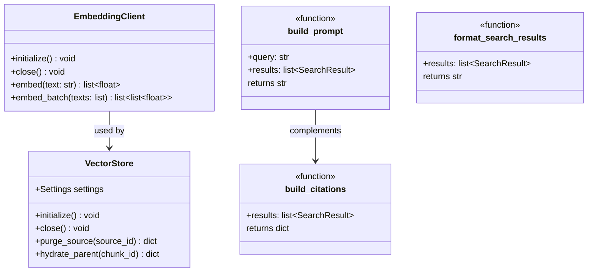

# Retrieval Layer (src/retrieval) - Agent Guide

## Purpose

Vector store operations, embedding generation, and result formatting for the RAG query path. This is the "read side" of the data plane — ingestion writes, retrieval reads.

## Architecture

## Module Files

| File | Purpose |
|------|---------|
| `embeddings.py` | OpenAI-compatible embedding client with batch support |
| `vector_store.py` | MongoDB vector store helpers — purge, hydrate |
| `formatting.py` | Prompt construction and citation building from search results |

## Durable Lessons

1. **Embeddings are list[float], always.** MongoDB Atlas Vector Search requires plain Python lists. Never convert to numpy arrays or string-encoded vectors.

2. **Citations are positional.** `build_citations()` assigns `[1]`, `[2]`, etc. based on result order. The LLM prompt and citation dict must use the same ordering. If you re-sort results, citations break.

3. **Purge is multi-path.** `VectorStore.purge_source()` matches on `source_url`, `metadata.source_url`, `metadata.gdrive_file_id`, `metadata.crawl_url`, and `metadata.source_group` because documents arrive from different integrations with different field naming.

4. **The embedding client is reusable.** `EmbeddingClient` is initialized once in `AgentDependencies` and shared across the application lifecycle. Don't create ad-hoc clients per call.

5. **Prompt format is the API contract with the LLM.** `build_prompt()` creates `[N] Title\nContent` blocks. The system prompt tells the LLM to cite with `[N]`. Changing either side breaks grounding verification.
