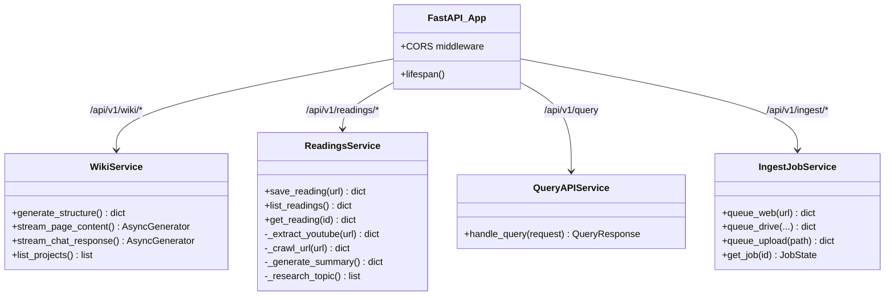
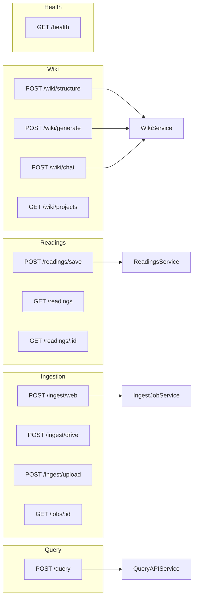

# Server Layer (src/server) - Agent Guide

## Purpose

FastAPI application with REST API endpoints for ingestion, querying, wiki generation, and the save-and-research reading pipeline. All business logic lives in `services/`; routes are thin wrappers.

## Architecture

## API Route Map

## Services Detail

### WikiService
Generates structured wikis from ingested data. Discovers documents in MongoDB, uses LLM to organize into sections/pages, streams page content via RAG (hybrid search → LLM).

### ReadingsService
Save-and-research pipeline (Wallabag/Instapaper style). Auto-detects YouTube URLs. Pipeline: crawl/extract → LLM summary → SearXNG research → MongoDB store → RAG ingestion queue.

### QueryAPIService
Grounded RAG query with citations. Delegates to `QueryService` which runs search → generation → grounding verification → trace storage.

### IngestJobService
Job queue via Redis/RQ. Queues ingestion work for async processing. Jobs transition through PENDING → STARTED → FINISHED/FAILED.

## Durable Lessons

1. **Routes are thin, services are fat.** Every router file is under 60 lines. All logic lives in `services/`. This keeps routing testable and logic reusable.

2. **Streaming via `StreamingResponse`.** Wiki page generation and chat both use FastAPI's `StreamingResponse` with async generators. This gives the frontend real-time token streaming.

3. **CORS is configured for the frontend.** Origins `localhost:3000` and `127.0.0.1:3000` are allowed. Update when deploying to production.

4. **Lifespan validation.** The `lifespan` context manager pings MongoDB at startup and fails fast if the database is unreachable. Don't remove this.

5. **API versioning via prefix.** All routes use `/api/v1/` prefix from `APIConfig`. When v2 arrives, add new routers without breaking existing clients.

6. **Media-type routing in ReadingsService.** `is_youtube_url()` at the top of `save_reading()` routes to the YouTube extraction pipeline. Add new media detectors here (podcasts, PDFs, etc.).
