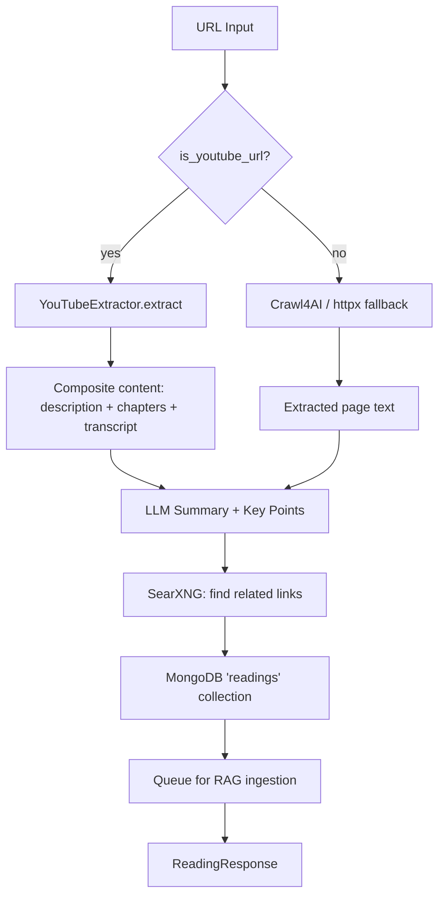

# Readings API (src/server/api/readings) - Agent Guide

## Purpose

Wallabag/Instapaper-style save-and-research endpoints. Save any URL (web page, YouTube video, tweet) and get back a summary, key points, and related links.

## Endpoints

| Method | Path | Description |
|--------|------|-------------|
| POST | `/readings/save` | Save URL → crawl → summarize → research → ingest |
| GET | `/readings` | List saved readings (newest first) |
| GET | `/readings/:id` | Get single reading with full detail |

## Save Pipeline

## Durable Lessons

1. **Detect, don't guess.** URL-type detection at the top of the pipeline (`is_youtube_url()`) routes to the correct extractor. Extend with `is_podcast_url()`, `is_pdf_url()`, etc.

2. **YouTube content is composite.** Description + chapter markers + full transcript are concatenated into one content block. This gives the LLM maximum context for summarisation.

3. **YouTube metadata is stored separately.** The `youtube` sub-document in MongoDB carries `video_id`, `channel`, `thumbnail_url`, `chapters`, `has_transcript` — distinct from the generic reading fields. This enables rich UI rendering.

4. **Ingestion is fire-and-forget.** `_queue_ingestion()` is wrapped in try/except and returns None on failure. The reading is saved even if the Redis queue is down.

5. **Graceful degradation everywhere.** If SearXNG is down, related_links is empty. If Crawl4AI fails, httpx tries. If the LLM fails, a basic "Saved from domain" summary is returned. The user always gets something.
