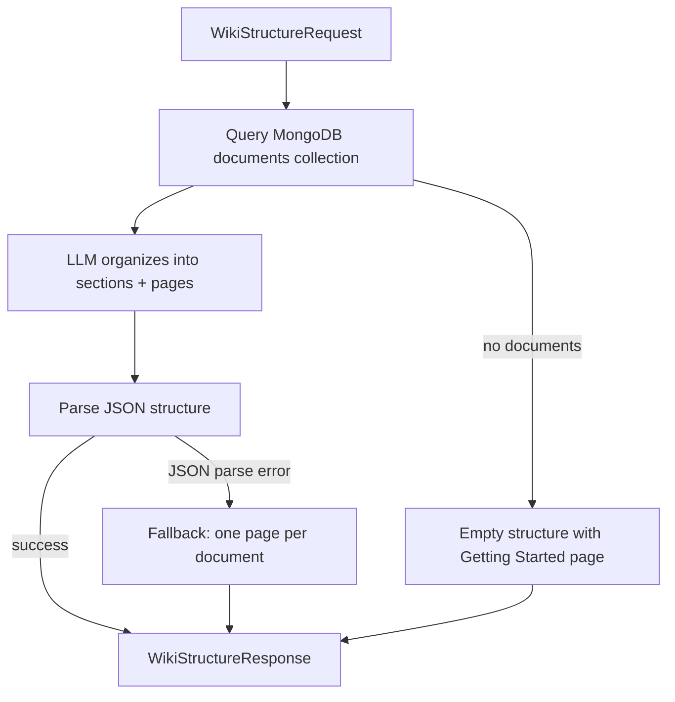

# Wiki API (src/server/api/wiki) - Agent Guide

## Purpose

REST endpoints for generating interactive knowledge wikis from ingested RAG data. Inspired by DeepWiki — creates structured, browsable documentation from any ingested content.

## Endpoints

| Method | Path | Description | Response |
|--------|------|-------------|----------|
| POST | `/wiki/structure` | Generate wiki structure from documents | `WikiStructureResponse` |
| POST | `/wiki/generate` | Stream page content via RAG | `StreamingResponse` |
| POST | `/wiki/chat` | Stream chat within wiki context | `StreamingResponse` |
| GET | `/wiki/projects` | List document groups as projects | `WikiProjectsListResponse` |

## Wiki Structure Generation Flow

## Durable Lessons

1. **LLM-generated structure needs fallbacks.** The LLM returns JSON for wiki structure, but it can fail to produce valid JSON. Always have `_fallback_structure()` ready.

2. **Page content is generated on-demand.** The structure endpoint returns pages with empty content. Content is generated lazily when the user navigates to a page — this keeps initial load fast.

3. **Streaming is the default.** Both `/generate` and `/chat` return `StreamingResponse`. The frontend displays tokens as they arrive.
