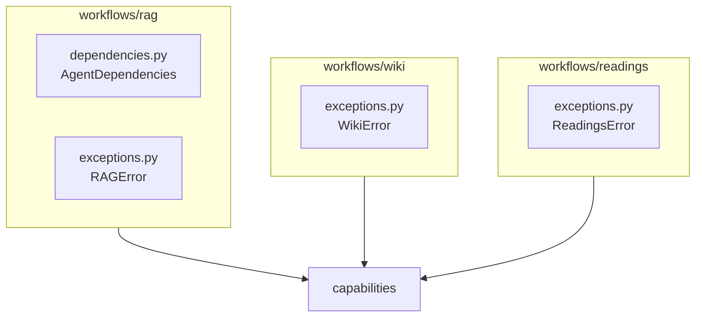
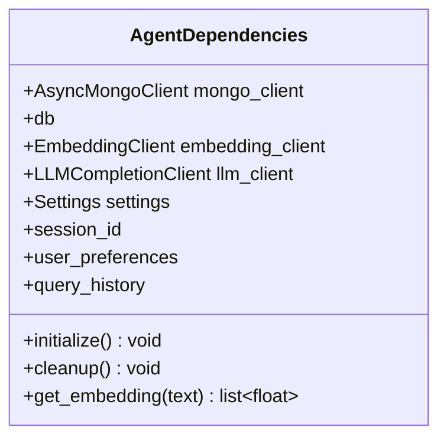

# Workflows Layer (src/workflows)

## Purpose

Orchestration of capabilities. Business logic and dependency wiring. RAG agent, wiki, readings, and NeuralCursor components.

## Architecture

### Structure



### Key Classes

| Class | Location | Purpose |
|-------|----------|---------|
| `AgentDependencies` | `workflows/rag/dependencies.py` | MongoDB, EmbeddingClient, LLM; injected into agent, query, wiki, readings |
| `RAGError` | `workflows/rag/exceptions.py` | RAG workflow failures |
| `WikiError` | `workflows/wiki/exceptions.py` | Wiki structure, streaming failures |
| `ReadingsError` | `workflows/readings/exceptions.py` | Save-reading, extraction failures |

### AgentDependencies (from code)



## RAG Workflow

- Agent and tools live at `src/agent.py`, `src/tools.py` (root-level; imported by CLI).
- `AgentDependencies` is in `workflows/rag/dependencies.py`; re-exported at `mdrag.dependencies`.

## Patterns

- **DO**: Use `AgentDependencies` via injection; avoid creating per-request clients.
- **DON'T**: Put API-specific logic (e.g. `ManagedDependencies`) in workflows; it belongs in `interfaces/api/dependencies.py`.

## JIT Search

```
rg "class AgentDependencies" src/workflows
rg "RAGError|WikiError|ReadingsError" src/workflows
```
